# Diagrama de Arquitectura — Ecosistema Batuta

## Vista General del Ecosistema

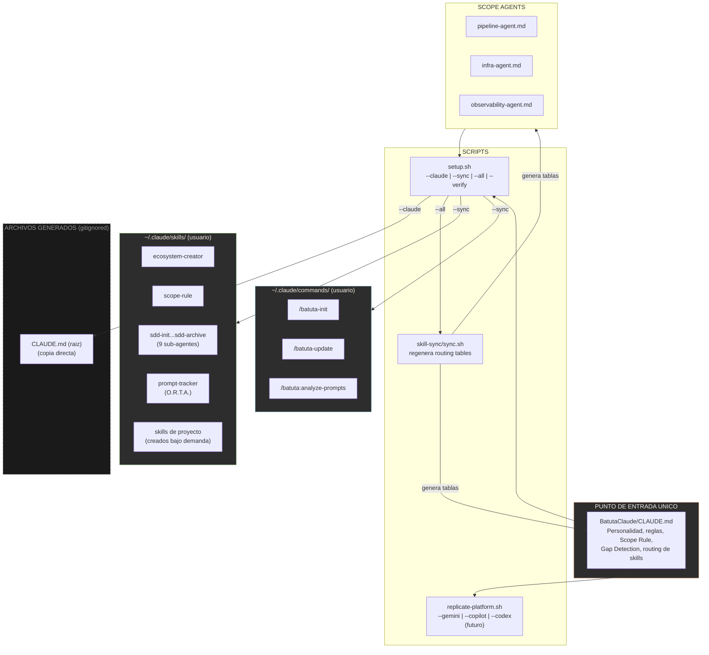

---

## Mix-of-Experts: Routing del Agente Principal (v5)

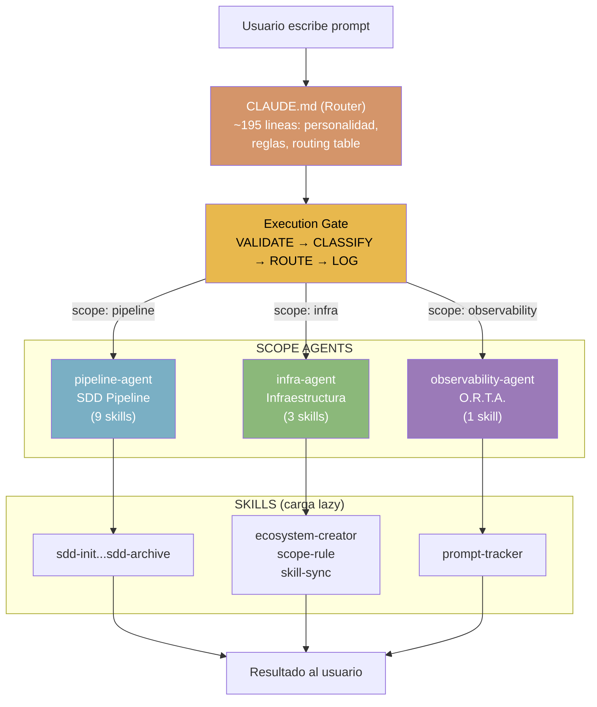

> El agente principal es un **router puro**. No ejecuta trabajo pesado — clasifica el scope y delega al agente experto. Solo el resultado vuelve al usuario.

---

## Skill-Sync: Redundancia Automatica (v5)

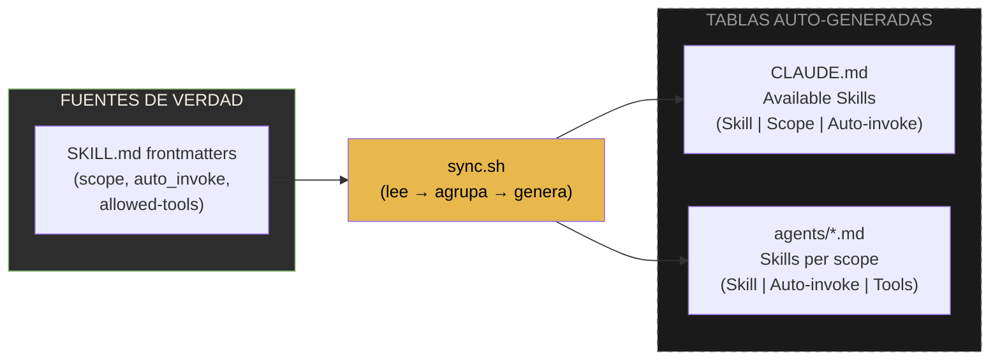

> Agregar un skill nuevo = crear SKILL.md con frontmatter → correr sync.sh → tablas actualizadas automaticamente. Sin edicion manual.

---

## Flujo de Trabajo SDD (Spec-Driven Development)

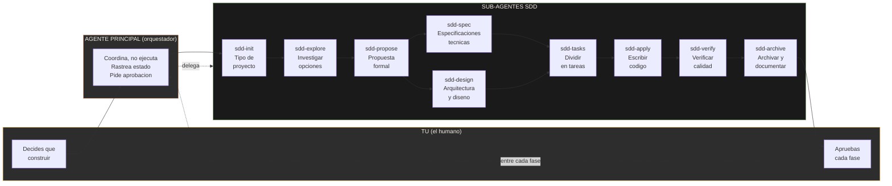

### Dependencias entre fases

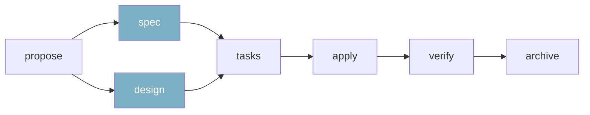

> **spec** y **design** pueden ejecutarse en paralelo. Ambos deben completarse antes de **tasks**.

---

## Carga Lazy de Skills (3 niveles)

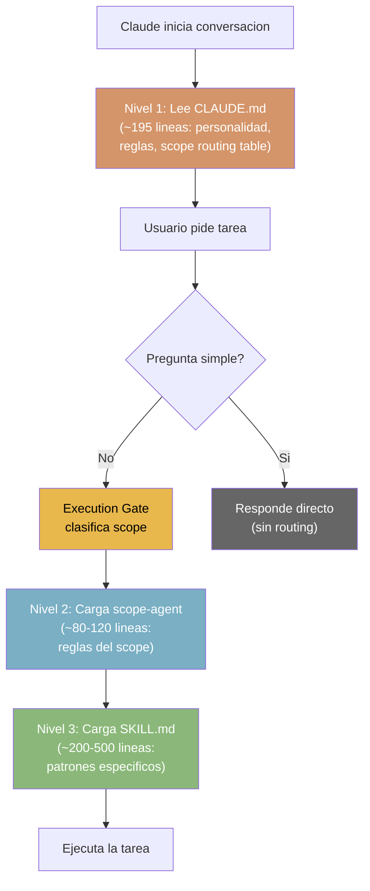

> Claude lee ~195 lineas al iniciar (Nivel 1). El scope agent agrega ~100 lineas (Nivel 2). El skill agrega ~200-500 lineas (Nivel 3). Solo se carga lo que se necesita.

---

## Continuidad de Sesion

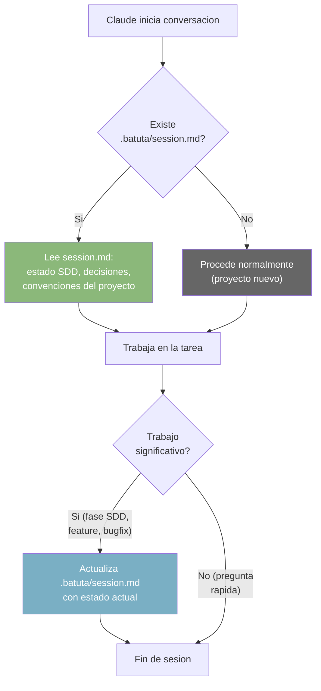

> Cada conversacion empieza leyendo el contexto de la anterior. Al terminar trabajo significativo, actualiza el archivo para la proxima sesion.

---

## Tracking de Satisfaccion de Prompts (O.R.T.A.)

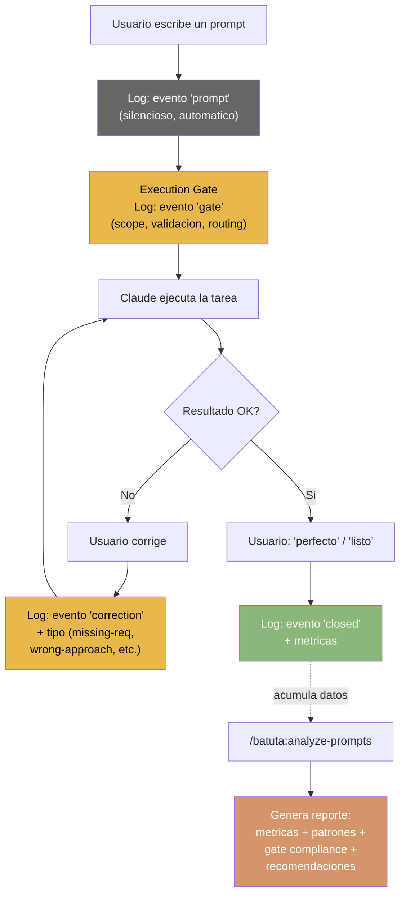

> El tracking es SILENCIOSO — Claude nunca pide "califica mi respuesta". El Execution Gate se ejecuta ANTES de cada cambio, validando y logeando la decision de routing. Despues, `/batuta:analyze-prompts` analiza todos los eventos y genera recomendaciones.

---

## Deteccion de Skills Faltantes

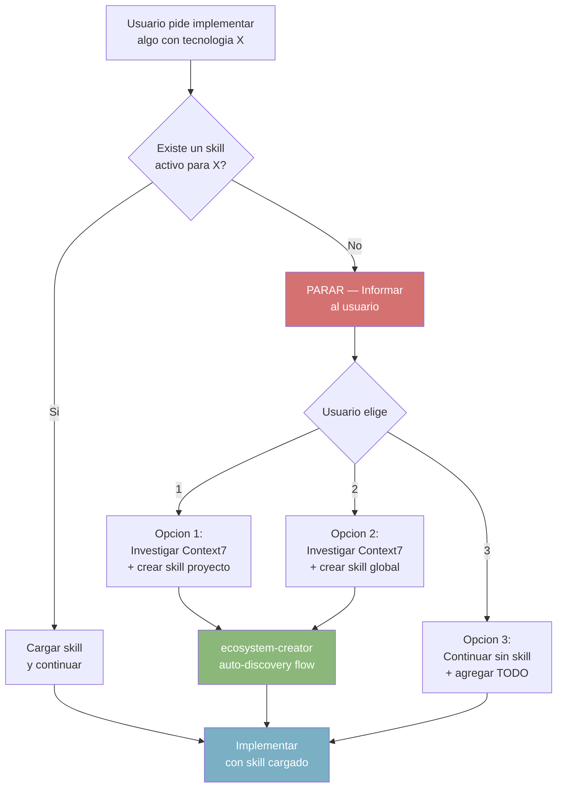

---

## Scope Rule (Regla de Alcance)

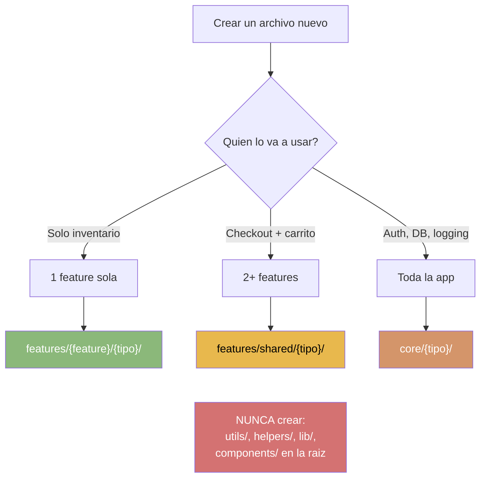

---

## Auto-Update SPO (Propagacion de Skills)

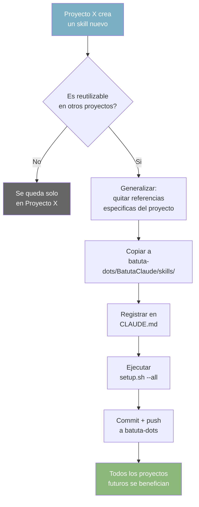

---

## Flujo Completo: Desde Carpeta Vacia hasta App en Internet

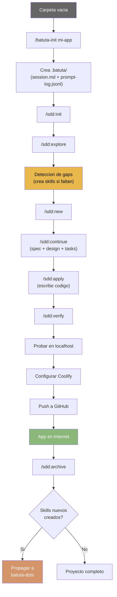

---

## Como ver estos diagramas

Estos diagramas usan **Mermaid**, un formato que se renderiza automaticamente en:
- **GitHub**: Abre este archivo en github.com y los diagramas se ven como imagenes
- **VS Code**: Instala la extension "Markdown Preview Mermaid Support"
- **Mermaid Live Editor**: Copia el codigo entre ```mermaid y ``` en [mermaid.live](https://mermaid.live)
