# Diagrama de Arquitectura — Ecosistema Batuta (v15)

## Vista General del Ecosistema

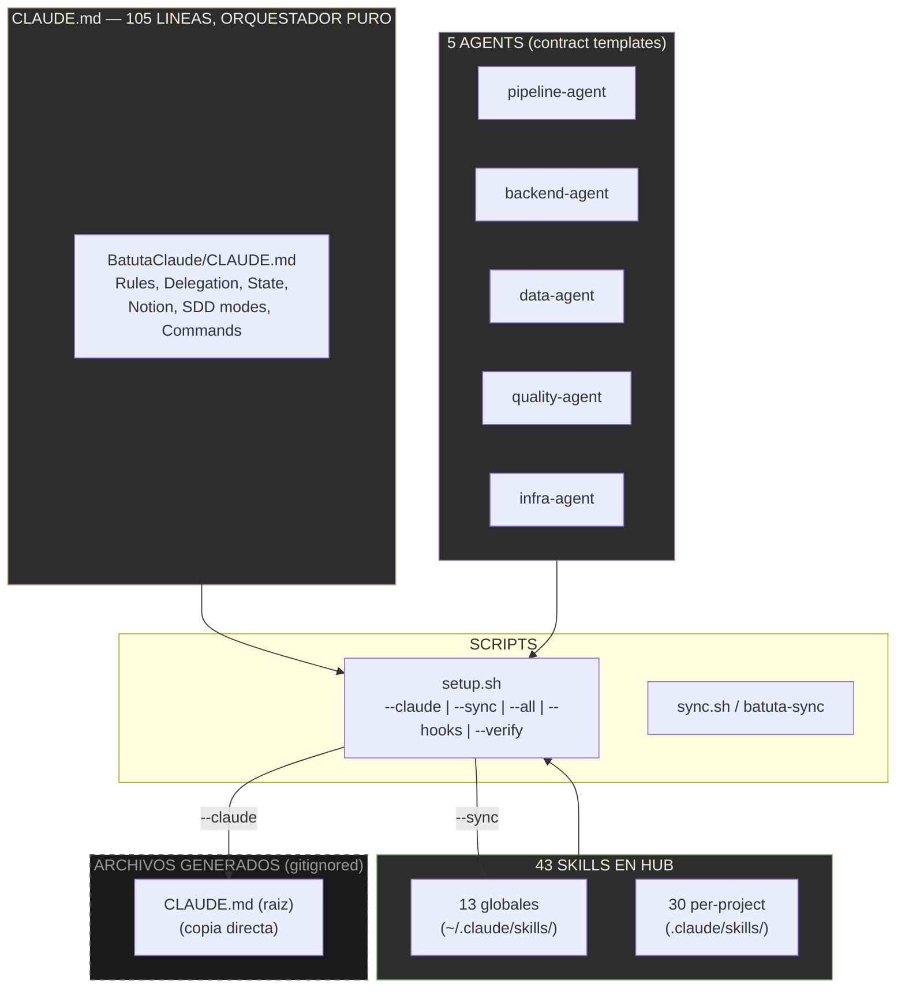

---

## Modelo de Delegacion: Main Agent = Gestor (v15)

El main agent NUNCA ejecuta. Para toda tarea, contrata un agente especializado via el skill `agent-hiring`.

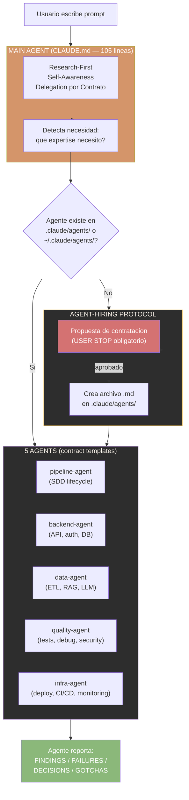

> El main agent no tiene skills cargados. Solo sabe a quien contratar. Skills pertenecen a los AGENTES. Los agentes reportan con formato estandar: FINDINGS, FAILURES, DECISIONS, GOTCHAS. Los agentes pueden correr en paralelo — 5 agentes investigando = minutos, no horas.

---

## SDD Pipeline: 2 Modos (v15)

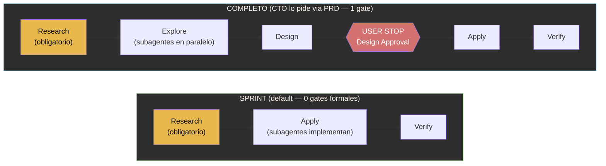

> **Research-First es NO NEGOCIABLE en ambos modos**. SPRINT no tiene gates formales — research → apply → verify. COMPLETO tiene 1 gate en Design Approval. PRD es el artefacto unico de planificacion — el CTO lo escribe en Notion, Claude Code lo lee via MCP.

### PRD como Artefacto Unico

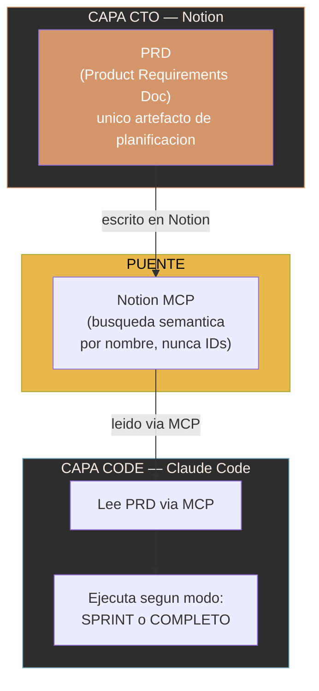

> El PRD reemplaza la cadena de 5 artefactos (explore → propose → spec → design → tasks). Un solo documento con todo lo necesario para ejecutar.

---

## Skills: Pertenecen a los Agentes, No al Main Agent (v15)

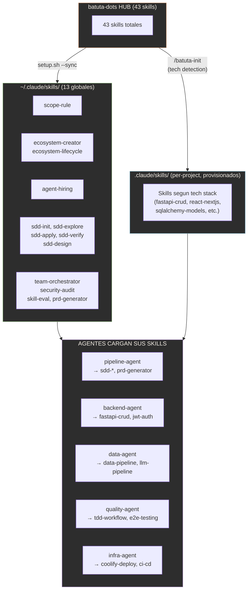

> El main agent NO carga skills. Claude Code carga solo descripciones de 1 linea (~450 tokens) al inicio. El contenido completo carga solo cuando un agente contratado lo necesita. Skills del hub: 13 globales + 30 per-project = 43 total.

---

## State: session.md como Fuente Unica de Verdad (v15)

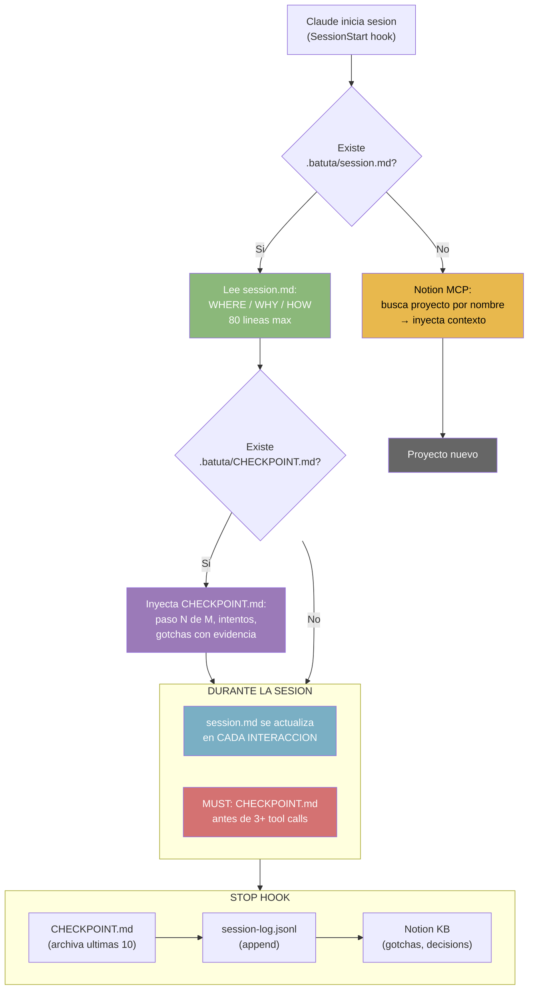

**Capas de persistencia (v15)**:

| Capa | Archivo | Proposito | Escrito | Leido |
|------|---------|-----------|---------|-------|
| Global | `MEMORY.md` | Preferencias usuario | Usuario/agente | Todos los proyectos |
| Sesion | `.batuta/session.md` | Fuente unica de verdad (WHERE/WHY/HOW) | Cada interaccion | SessionStart, CTO |
| Anti-compaction | `.batuta/CHECKPOINT.md` | Estado operacional (paso N de M) | MUST rule + Stop | SessionStart (auto) |
| Largo plazo | Notion KB | Gotchas, decisions, discoveries | Stop (auto, si MCP) | Research-First chain |

> session.md se actualiza en CADA interaccion, no solo al cerrar. Es la fuente unica de verdad. CHECKPOINT.md es el seguro anti-compaction — captura lo que session.md no puede (intentos fallidos, evidencia de decisiones).

---

## Research-First Chain (v15)

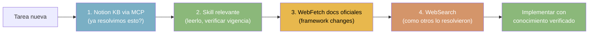

> Research se hace con subagentes en paralelo. 5 subagentes investigando = minutos. Training data puede estar desactualizado — verificar SIEMPRE. Si no hay skill → buscar en web → considerar crear skill si el patron es reutilizable.

---

## Notion MCP: Puente CTO ↔ Code (v15)

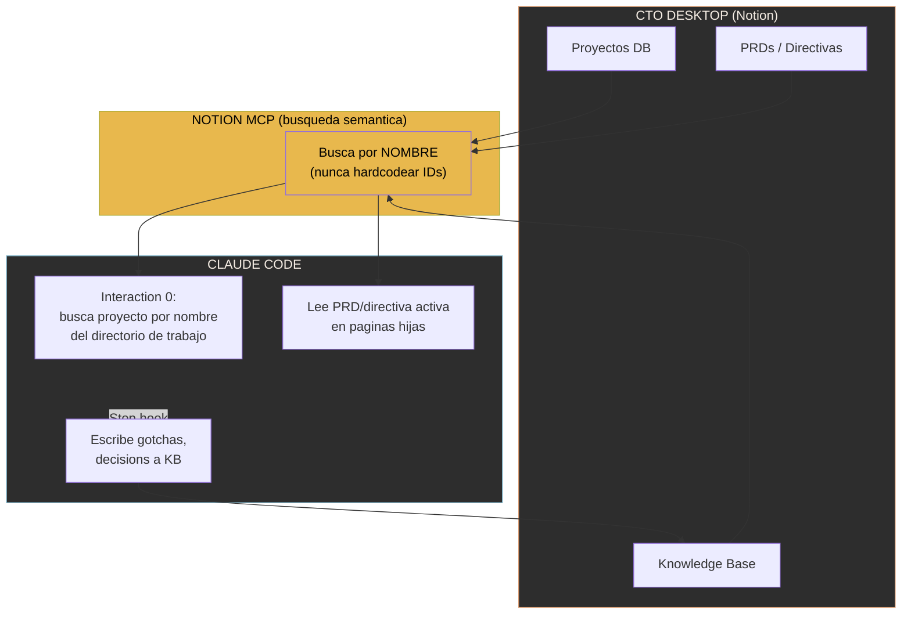

> NUNCA hardcodear database IDs, page IDs, o data_source_ids. Los IDs cambian — los nombres persisten. Si Notion MCP no disponible, continuar sin bloquear.

---

## Flujo Completo: Desde Prompt hasta Resultado (v15)

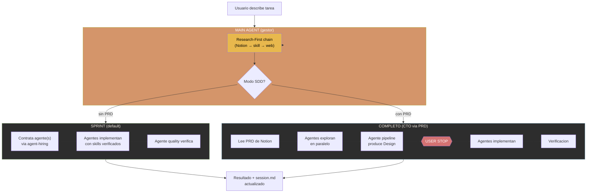

---

## Hooks: Enforcement Deterministico (v15)

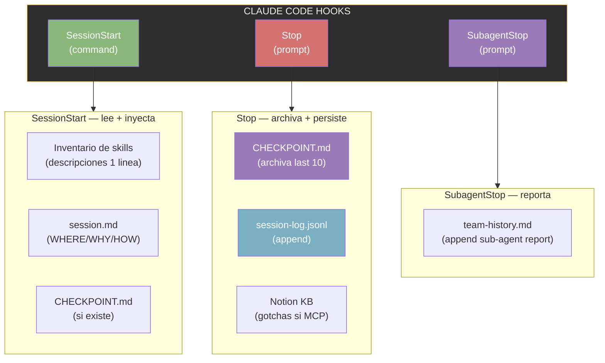

> Hooks ejecutan deterministicamente — no dependen de que Claude "recuerde". SessionStart inyecta contexto. Stop archiva y persiste. SubagentStop captura reportes de agentes contratados en team-history.md.

---

## Scope Rule

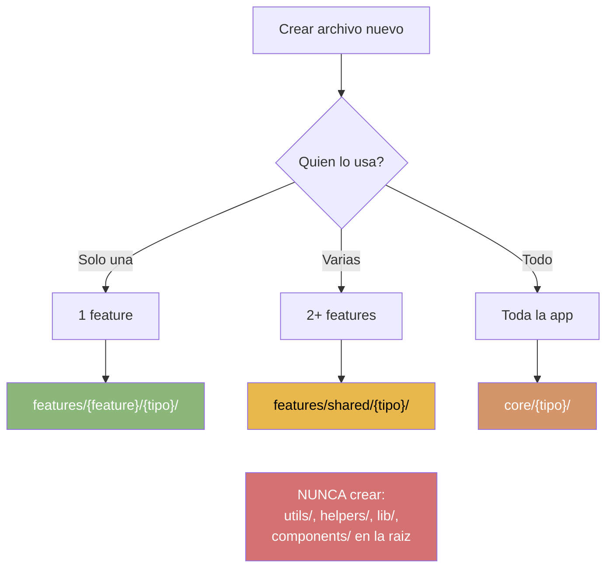

---

## Skill Sync: Hub → Proyectos (v15)

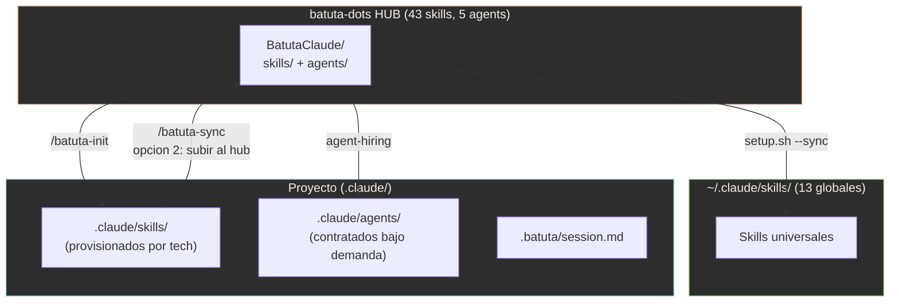

> `/batuta-sync` maneja el flujo bidireccional: opcion 2 = subir al hub, opcion 3 = traer del hub. Skills se provisionan con `/batuta-init` (tech detection). Agents se crean bajo demanda via `agent-hiring`.

---

## AI Validation Pyramid

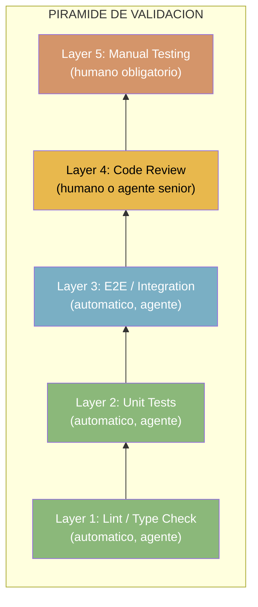

> Layers 1-3: agente (automatico). Layers 4-5: humano (obligatorio). No existe validacion 100% automatica.

---

## Folder Structure (v15)

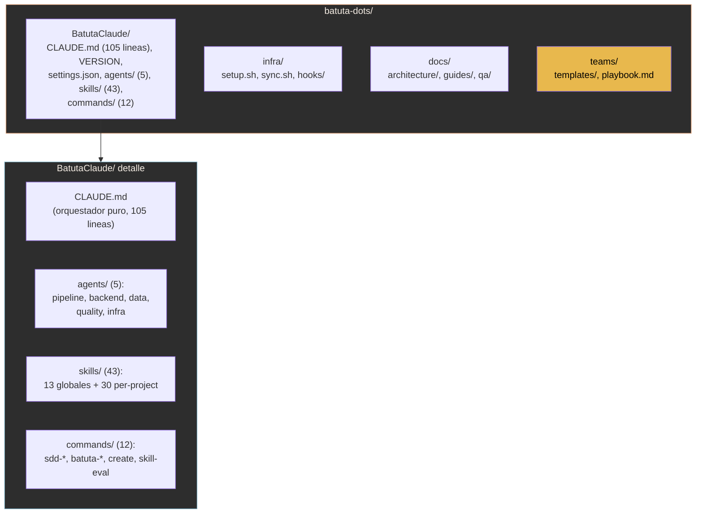

---

## Modelo de Agentes (v15)

| Agente | Rol | Skills que carga | Cuando se activa |
|--------|-----|-----------------|-----------------|
| `pipeline-agent` | SDD lifecycle | sdd-*, prd-generator | Build / Continue |
| `backend-agent` | API, auth, DB | fastapi-crud, jwt-auth, sqlalchemy-models | Senales: API, auth, ORM |
| `data-agent` | ETL, RAG, LLM | data-pipeline, llm-pipeline, vector-db-rag | Senales: datos, ETL, AI |
| `quality-agent` | Tests, debug, security | tdd-workflow, e2e-testing, security-audit | Siempre disponible |
| `infra-agent` | Deploy, CI/CD, monitoring | coolify-deploy, ci-cd-pipeline, observability | Senales: deploy, infra |

> 5 agentes como contract templates. El main agent los contrata via `agent-hiring`. Cada agente es un archivo `.md` — contrato permanente que persiste entre proyectos. Los agentes pueden correr en paralelo.

---

## Resumen de Cambios v14 → v15

| Aspecto | v14 | v15 |
|---------|-----|-----|
| CLAUDE.md | ~331 lineas (personalidad, filosofia, routing) | 105 lineas (orquestador puro: rules, delegation, state) |
| SDD Pipeline | 9 fases, 8 gates | 2 modos: SPRINT (0 gates) y COMPLETO (1 gate en Design) |
| Artefactos de planificacion | 5 (explore, propose, spec, design, tasks) | 1 (PRD) |
| Main agent | Router MoE que ejecuta via routing | Gestor que NUNCA ejecuta — contrata agentes |
| Skills | Pertenecen al main agent | Pertenecen a los AGENTES |
| Agents | 6 (3 scope + 3 domain) | 5 contract templates (pipeline, backend, data, quality, infra) |
| session.md | Escrito al cerrar sesion | Actualizado en CADA interaccion |
| Notion | IDs hardcodeados | Busqueda semantica por nombre, nunca IDs |
| Research | Gate opcional en explore | NO NEGOCIABLE en todos los modos |
| Hub skills | 38 | 43 (13 globales + 30 per-project) |

---

## Como ver estos diagramas

Estos diagramas usan **Mermaid**, un formato que se renderiza automaticamente en:
- **GitHub**: Abre este archivo en github.com y los diagramas se ven como imagenes
- **VS Code**: Instala la extension "Markdown Preview Mermaid Support"
- **Mermaid Live Editor**: Copia el codigo entre ```mermaid y ``` en [mermaid.live](https://mermaid.live)
