# Diagrama de Arquitectura — Ecosistema Batuta (v13.1)

## Vista General del Ecosistema

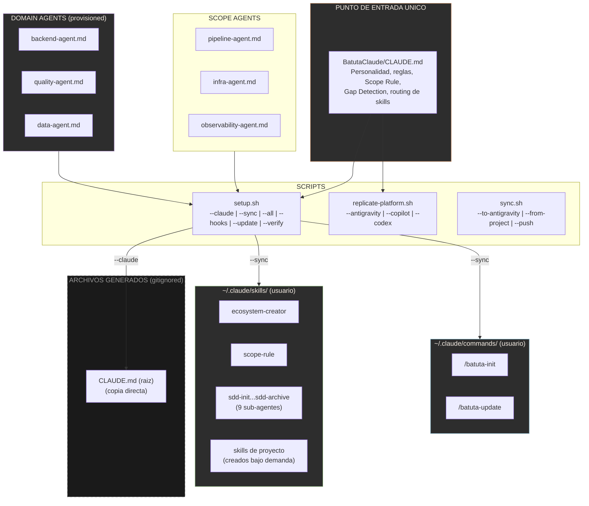
```mermaid
flowchart TB
    subgraph FUENTE["PUNTO DE ENTRADA UNICO"]
        CLAUDE_SRC["BatutaClaude/CLAUDE.md<br/>Personalidad, reglas, Scope Rule,<br/>Gap Detection, routing de skills"]
    end

    subgraph AGENTS_SRC["SCOPE AGENTS"]
        AG_PIPELINE["pipeline-agent.md"]
        AG_INFRA["infra-agent.md"]
        AG_OBS["observability-agent.md"]
    end

    subgraph DOMAIN_SRC["DOMAIN AGENTS (provisioned)"]
        AG_BACKEND["backend-agent.md"]
        AG_QUALITY["quality-agent.md"]
        AG_DATA["data-agent.md"]
    end

    subgraph SETUP["SCRIPTS"]
        SETUP_SH["setup.sh<br/>--claude | --sync | --all | --hooks | --update | --verify"]
        REPLICATE["replicate-platform.sh<br/>--antigravity | --copilot | --codex"]
        SYNC_BI["sync.sh<br/>--to-antigravity | --from-project | --push"]
    end

    subgraph GENERADO["ARCHIVOS GENERADOS (gitignored)"]
        CLAUDE_GEN["CLAUDE.md (raiz)<br/>(copia directa)"]
    end

    subgraph SKILLS_LOCAL["~/.claude/skills/ (usuario)"]
        SK_ECO["ecosystem-creator"]
        SK_SCOPE["scope-rule"]
        SK_SDD["sdd-init...sdd-archive<br/>(9 sub-agentes)"]
        SK_PROJECT["skills de proyecto<br/>(creados bajo demanda)"]
    end

    subgraph COMMANDS_LOCAL["~/.claude/commands/ (usuario)"]
        CMD_INIT["/batuta-init"]
        CMD_UPDATE["/batuta-update"]
    end

    CLAUDE_SRC --> SETUP_SH
    AGENTS_SRC --> SETUP_SH
    DOMAIN_SRC --> SETUP_SH
    SETUP_SH -->|"--claude"| CLAUDE_GEN
    SETUP_SH -->|"--sync"| SKILLS_LOCAL
    SETUP_SH -->|"--sync"| COMMANDS_LOCAL
    CLAUDE_SRC --> REPLICATE

    style FUENTE fill:#2d2d2d,stroke:#D4956A,color:#F5EDE4
    style GENERADO fill:#1a1a1a,stroke:#666,color:#999,stroke-dasharray: 5 5
    style SKILLS_LOCAL fill:#2d2d2d,stroke:#8BB87A,color:#F5EDE4
    style COMMANDS_LOCAL fill:#2d2d2d,stroke:#7AAFC4,color:#F5EDE4
    style DOMAIN_SRC fill:#2d2d2d,stroke:#9B7AB8,color:#F5EDE4
```

---

## Mixture of Experts (MoE): Modelo Conceptual (v13.1)

Batuta sigue una arquitectura **Mixture of Experts** adaptada a agentes de IA:

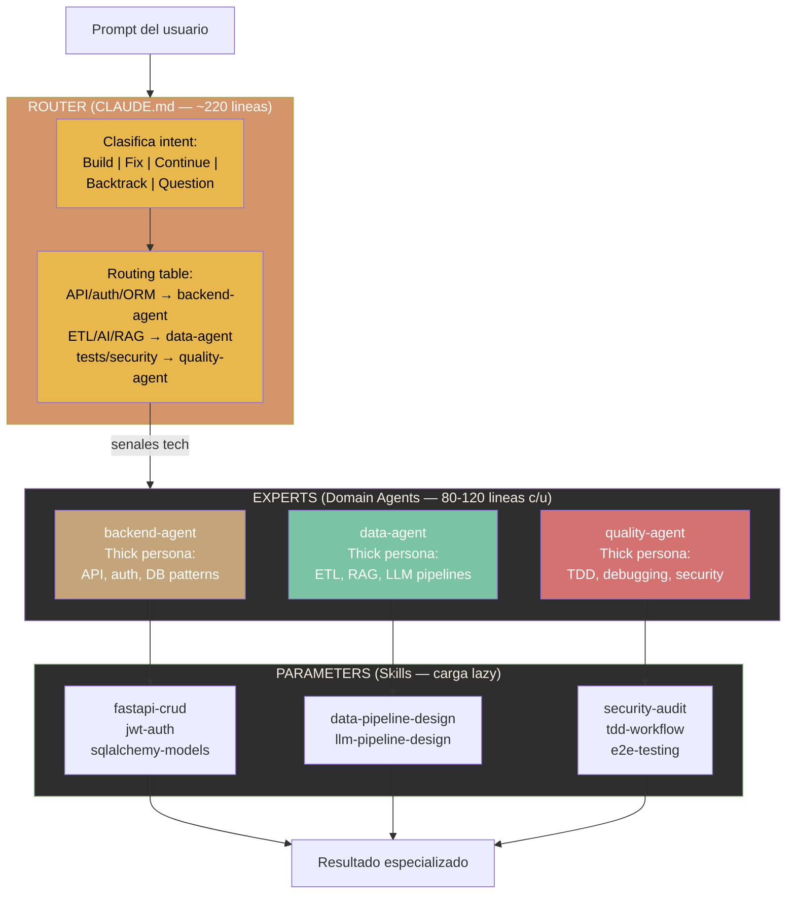
```mermaid
flowchart TD
    INPUT["Prompt del usuario"]

    subgraph ROUTER["ROUTER (CLAUDE.md — ~220 lineas)"]
        CLASSIFY["Clasifica intent:<br/>Build | Fix | Continue |<br/>Backtrack | Question"]
        ROUTE["Routing table:<br/>API/auth/ORM → backend-agent<br/>ETL/AI/RAG → data-agent<br/>tests/security → quality-agent"]
    end

    subgraph EXPERTS["EXPERTS (Domain Agents — 80-120 lineas c/u)"]
        direction LR
        BACKEND_E["backend-agent<br/>Thick persona:<br/>API, auth, DB patterns"]
        DATA_E["data-agent<br/>Thick persona:<br/>ETL, RAG, LLM pipelines"]
        QUALITY_E["quality-agent<br/>Thick persona:<br/>TDD, debugging, security"]
    end

    subgraph PARAMETERS["PARAMETERS (Skills — carga lazy)"]
        direction LR
        SK1["fastapi-crud<br/>jwt-auth<br/>sqlalchemy-models"]
        SK2["data-pipeline-design<br/>llm-pipeline-design"]
        SK3["security-audit<br/>tdd-workflow<br/>e2e-testing"]
    end

    OUTPUT["Resultado especializado"]

    INPUT --> ROUTER
    CLASSIFY --> ROUTE
    ROUTE -->|"senales tech"| EXPERTS
    BACKEND_E --> SK1
    DATA_E --> SK2
    QUALITY_E --> SK3
    SK1 --> OUTPUT
    SK2 --> OUTPUT
    SK3 --> OUTPUT

    style ROUTER fill:#D4956A,color:#fff
    style EXPERTS fill:#2d2d2d,stroke:#9B7AB8,color:#F5EDE4
    style PARAMETERS fill:#2d2d2d,stroke:#8BB87A,color:#F5EDE4
    style CLASSIFY fill:#E8B84D,color:#000
    style ROUTE fill:#E8B84D,color:#000
    style BACKEND_E fill:#C4A47A,color:#fff
    style DATA_E fill:#7AC4A4,color:#fff
    style QUALITY_E fill:#D47272,color:#fff
```

> **Analogia con MoE en ML**: En un modelo Mixture of Experts, un router decide que experto procesa cada token. En Batuta: el **Router** (CLAUDE.md) clasifica el intent del usuario y las senales tecnologicas. Los **Experts** (domain agents) son subprocesos autonomos con 80-120 lineas de expertise embebido ("thick persona"). Los **Parameters** (skills) son patrones cargados bajo demanda dentro de cada experto. Esta separacion ahorra tokens — cada domain agent corre en su propio contexto via Task tool, sin inyectar su expertise en el agente principal.

### Tabla de Routing: Senales → Experto

| Senales en el prompt | Experto activado | Delegacion |
|---------------------|-----------------|------------|
| API endpoints, auth flows, ORM, migrations, REST | `backend-agent` | Implementacion server-side, esquema DB, middleware auth |
| ETL, transformaciones de datos, LLM, RAG, vector DBs | `data-agent` | Diseno de pipeline, implementacion AI/ML, arquitectura de datos |
| Tests, debugging, security review, code quality, E2E | `quality-agent` | Planes de test, debugging sistematico, auditorias de seguridad |

Los domain agents corren como **subprocesos autonomos** (Task tool), no como inyeccion de contexto inline. Esto significa que cada experto carga su propio contexto y skills, manteniendo al agente principal ligero.

---

## Scope + Domain Agents: Routing del Agente Principal (v13)

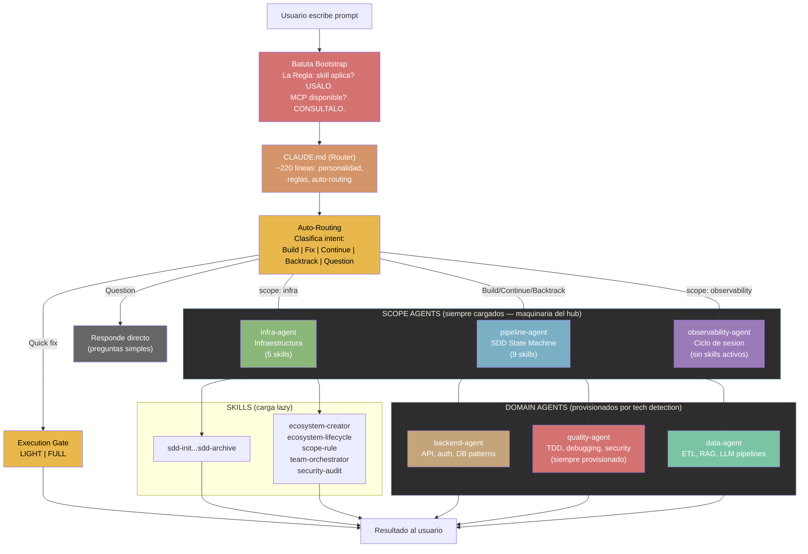
```mermaid
flowchart TD
    USER["Usuario escribe prompt"]
    BOOTSTRAP["Batuta Bootstrap<br/>La Regla: skill aplica? USALO.<br/>MCP disponible? CONSULTALO."]
    AUTOROUTE["Auto-Routing<br/>Clasifica intent:<br/>Build | Fix | Continue | Backtrack | Question"]
    ROUTER["CLAUDE.md (Router)<br/>~220 lineas: personalidad,<br/>reglas, auto-routing"]

    subgraph SCOPE_AGENTS["SCOPE AGENTS (siempre cargados — maquinaria del hub)"]
        PIPELINE["pipeline-agent<br/>SDD State Machine<br/>(9 skills)"]
        INFRA["infra-agent<br/>Infraestructura<br/>(5 skills)"]
        OBS["observability-agent<br/>Ciclo de sesion<br/>(sin skills activos)"]
    end

    subgraph DOMAIN_AGENTS["DOMAIN AGENTS (provisionados por tech detection)"]
        BACKEND["backend-agent<br/>API, auth, DB patterns"]
        QUALITY["quality-agent<br/>TDD, debugging, security<br/>(siempre provisionado)"]
        DATA["data-agent<br/>ETL, RAG, LLM pipelines"]
    end

    subgraph SKILLS["SKILLS (carga lazy)"]
        SDD["sdd-init...sdd-archive"]
        ECO["ecosystem-creator<br/>ecosystem-lifecycle<br/>scope-rule<br/>team-orchestrator<br/>security-audit"]
    end

    RESULT["Resultado al usuario"]
    DIRECT["Responde directo<br/>(preguntas simples)"]
    GATE["Execution Gate<br/>LIGHT | FULL"]

    USER --> BOOTSTRAP --> ROUTER --> AUTOROUTE
    AUTOROUTE -->|"Build/Continue/Backtrack"| PIPELINE
    AUTOROUTE -->|"scope: infra"| INFRA
    AUTOROUTE -->|"scope: observability"| OBS
    AUTOROUTE -->|"Question"| DIRECT
    AUTOROUTE -->|"Quick fix"| GATE --> RESULT
    PIPELINE --> SDD
    PIPELINE --> BACKEND
    PIPELINE --> QUALITY
    PIPELINE --> DATA
    INFRA --> ECO
    SDD --> RESULT
    ECO --> RESULT
    BACKEND --> RESULT
    QUALITY --> RESULT
    DATA --> RESULT

    style ROUTER fill:#D4956A,color:#fff
    style BOOTSTRAP fill:#D47272,color:#fff
    style AUTOROUTE fill:#E8B84D,color:#000
    style PIPELINE fill:#7AAFC4,color:#fff
    style INFRA fill:#8BB87A,color:#fff
    style OBS fill:#9B7AB8,color:#fff
    style SCOPE_AGENTS fill:#2d2d2d,stroke:#7AAFC4,color:#F5EDE4
    style DOMAIN_AGENTS fill:#2d2d2d,stroke:#9B7AB8,color:#F5EDE4
    style BACKEND fill:#C4A47A,color:#fff
    style QUALITY fill:#D47272,color:#fff
    style DATA fill:#7AC4A4,color:#fff
    style DIRECT fill:#666,color:#fff
    style GATE fill:#E8B84D,color:#000
```

> El agente principal es un **router** con **auto-routing**. Clasifica el intent del usuario (Build, Fix, Continue, Backtrack, Question) y delega automaticamente — el usuario no necesita escribir slash commands. Los comandos existen como override manual. Los skills son auto-descubiertos por Claude Code basandose en su campo `description`. Los **scope agents** siempre estan cargados (maquinaria del hub). Los **domain agents** se provisionan a cada proyecto segun su tech stack — excepto quality-agent que siempre esta presente.

---

## Skill Inventory: Sync Automatico

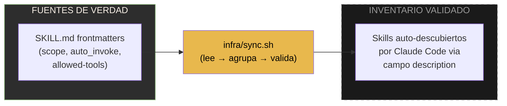
```mermaid
flowchart LR
    subgraph FUENTE["FUENTES DE VERDAD"]
        SKILLS_MD["SKILL.md frontmatters<br/>(scope, auto_invoke,<br/>allowed-tools)"]
    end

    SYNC["infra/sync.sh<br/>(lee → agrupa → valida)"]

    subgraph RESULTADO["INVENTARIO VALIDADO"]
        CLAUDE_TABLE["Skills auto-descubiertos<br/>por Claude Code via<br/>campo description"]
    end

    SKILLS_MD --> SYNC
    SYNC --> CLAUDE_TABLE

    style FUENTE fill:#2d2d2d,stroke:#8BB87A,color:#F5EDE4
    style SYNC fill:#E8B84D,color:#000
    style RESULTADO fill:#1a1a1a,stroke:#666,color:#999,stroke-dasharray: 5 5
```

> Agregar un skill nuevo = crear SKILL.md con frontmatter → correr sync.sh → inventario validado automaticamente.

---

### Flujo de Provisioning de Skills y Agents (v13)

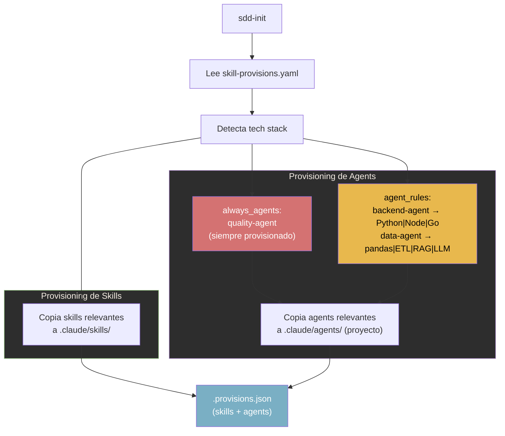
```mermaid
flowchart TD
    INIT["sdd-init"]
    READ["Lee skill-provisions.yaml"]
    DETECT["Detecta tech stack"]

    subgraph SKILLS_PROV["Provisioning de Skills"]
        COPY_SKILLS["Copia skills relevantes<br/>a .claude/skills/"]
    end

    subgraph AGENTS_PROV["Provisioning de Agents"]
        ALWAYS["always_agents:<br/>quality-agent<br/>(siempre provisionado)"]
        RULES["agent_rules:<br/>backend-agent → Python|Node|Go<br/>data-agent → pandas|ETL|RAG|LLM"]
        COPY_AGENTS["Copia agents relevantes<br/>a .claude/agents/ (proyecto)"]
    end

    MANIFEST[".provisions.json<br/>(skills + agents)"]

    INIT --> READ --> DETECT
    DETECT --> COPY_SKILLS
    DETECT --> ALWAYS
    DETECT --> RULES
    ALWAYS --> COPY_AGENTS
    RULES --> COPY_AGENTS
    COPY_SKILLS --> MANIFEST
    COPY_AGENTS --> MANIFEST

    style SKILLS_PROV fill:#2d2d2d,stroke:#8BB87A,color:#F5EDE4
    style AGENTS_PROV fill:#2d2d2d,stroke:#9B7AB8,color:#F5EDE4
    style ALWAYS fill:#D47272,color:#fff
    style RULES fill:#E8B84D,color:#000
    style MANIFEST fill:#7AAFC4,color:#fff
```

session-start.sh usa logica 3-way:
- `.provisions.json` existe → SOLO skills y agents locales (proyecto provisionado)
- `.claude/skills/` sin manifest → locales + globales (backward compatible)
- Sin skills locales → solo globales (backward compatible)

> El provisioning permite que cada proyecto reciba exactamente los skills y agents que necesita segun su tech stack. `always_agents` garantiza que quality-agent este en todos los proyectos. `agent_rules` mapea tecnologias detectadas a domain agents especificos. La logica 3-way garantiza compatibilidad hacia atras con proyectos existentes.

---

## Ciclo de Vida de un Agent (v13.1)

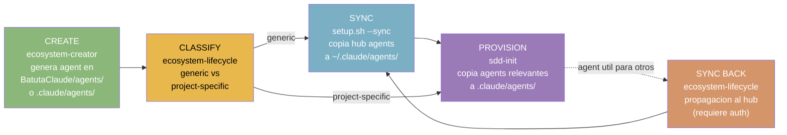
```mermaid
flowchart LR
    CREATE["CREATE<br/>ecosystem-creator<br/>genera agent en<br/>BatutaClaude/agents/<br/>o .claude/agents/"]
    CLASSIFY["CLASSIFY<br/>ecosystem-lifecycle<br/>generic vs<br/>project-specific"]
    SYNC["SYNC<br/>setup.sh --sync<br/>copia hub agents<br/>a ~/.claude/agents/"]
    PROVISION["PROVISION<br/>sdd-init<br/>copia agents relevantes<br/>a .claude/agents/"]
    SYNCBACK["SYNC BACK<br/>ecosystem-lifecycle<br/>propagacion al hub<br/>(requiere auth)"]

    CREATE --> CLASSIFY
    CLASSIFY -->|"generic"| SYNC --> PROVISION
    CLASSIFY -->|"project-specific"| PROVISION
    PROVISION -.->|"agent util para otros"| SYNCBACK --> SYNC

    style CREATE fill:#8BB87A,color:#fff
    style CLASSIFY fill:#E8B84D,color:#000
    style SYNC fill:#7AAFC4,color:#fff
    style PROVISION fill:#9B7AB8,color:#fff
    style SYNCBACK fill:#D4956A,color:#fff
```

> **Ciclo completo**: crear → clasificar → sincronizar → provisionar → (opcionalmente) sincronizar de vuelta al hub. Los agents **genericos** (utiles para cualquier proyecto) fluyen al hub y de ahi a todos los proyectos. Los agents **project-specific** se quedan locales. Si un agent local demuestra utilidad general, `ecosystem-lifecycle` propone propagarlo al hub — siempre con autorizacion del usuario.

### Modelo de Cantidad de Agents

| Tipo | Cantidad | Criterio de crecimiento |
|------|----------|------------------------|
| **Scope agents** (pipeline, infra, observability) | Fijo en 3 | Maquinaria del SDD pipeline — no crece |
| **Domain agents** (backend, quality, data) | 3-8 total | Solo crece para dominios genuinamente nuevos (mobile, DevOps, frontend) |
| **Project-specific** | Variable | Se quedan locales, no sincronizan al hub a menos que se generalicen |

Un domain agent nuevo solo se justifica cuando el dominio tiene: (1) convenciones propias que difieren de agents existentes, (2) 3+ skills que le pertenecen, y (3) limites de scope claros (own/coordinate/don't-touch).

---

## Flujo de Trabajo SDD (Spec-Driven Development) — v11 State Machine

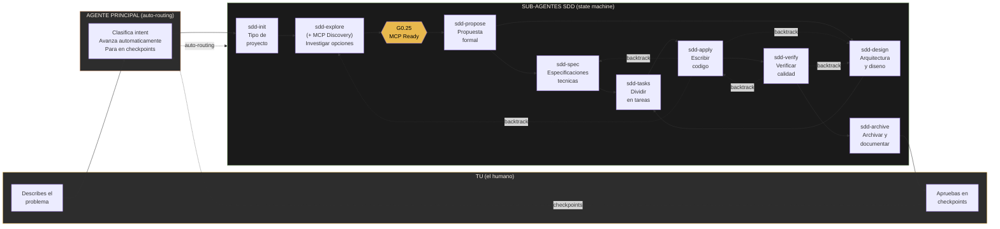
```mermaid
flowchart LR
    subgraph USUARIO["TU (el humano)"]
        U_DESCRIBE["Describes el<br/>problema"]
        U_APRUEBA["Apruebas en<br/>checkpoints"]
    end

    subgraph ORQUESTADOR["AGENTE PRINCIPAL (auto-routing)"]
        ORC["Clasifica intent<br/>Avanza automaticamente<br/>Para en checkpoints"]
    end

    subgraph PIPELINE["SUB-AGENTES SDD (state machine)"]
        direction LR
        INIT["sdd-init<br/>Tipo de<br/>proyecto"]
        EXPLORE["sdd-explore<br/>(+ MCP Discovery)<br/>Investigar opciones"]
        G025{{"G0.25<br/>MCP Ready"}}
        PROPOSE["sdd-propose<br/>Propuesta<br/>formal"]
        SPEC["sdd-spec<br/>Especificaciones<br/>tecnicas"]
        DESIGN["sdd-design<br/>Arquitectura<br/>y diseno"]
        TASKS["sdd-tasks<br/>Dividir<br/>en tareas"]
        APPLY["sdd-apply<br/>Escribir<br/>codigo"]
        VERIFY["sdd-verify<br/>Verificar<br/>calidad"]
        ARCHIVE["sdd-archive<br/>Archivar y<br/>documentar"]
    end

    U_DESCRIBE --> ORC
    ORC --> INIT --> EXPLORE --> G025 --> PROPOSE
    PROPOSE --> SPEC
    PROPOSE --> DESIGN
    SPEC --> TASKS
    DESIGN --> TASKS
    TASKS --> APPLY --> VERIFY --> ARCHIVE
    ARCHIVE --> U_APRUEBA

    APPLY -.->|"backtrack"| SPEC
    APPLY -.->|"backtrack"| DESIGN
    APPLY -.->|"backtrack"| EXPLORE
    VERIFY -.->|"backtrack"| DESIGN
    VERIFY -.->|"backtrack"| APPLY

    ORC -.->|"auto-routing"| PIPELINE
    U_APRUEBA -.->|"checkpoints"| ORC

    style USUARIO fill:#2d2d2d,stroke:#E8B84D,color:#F5EDE4
    style ORQUESTADOR fill:#2d2d2d,stroke:#D4956A,color:#F5EDE4
    style PIPELINE fill:#1a1a1a,stroke:#8BB87A,color:#F5EDE4
    style G025 fill:#E8B84D,color:#000
```

### Dependencias entre fases (con backtracks)

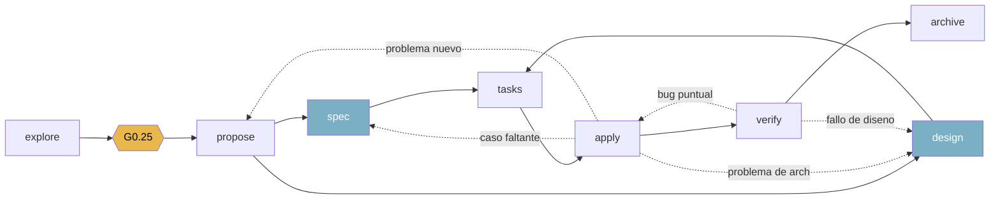
```mermaid
graph LR
    E[explore] --> G025{{"G0.25"}} --> P[propose] --> S[spec]
    P --> D[design]
    S --> T[tasks]
    D --> T
    T --> A[apply]
    A --> V[verify]
    V --> AR[archive]

    A -.->|"caso faltante"| S
    A -.->|"problema de arch"| D
    A -.->|"problema nuevo"| P
    V -.->|"fallo de diseno"| D
    V -.->|"bug puntual"| A

    style S fill:#7AAFC4,color:#fff
    style D fill:#7AAFC4,color:#fff
    style G025 fill:#E8B84D,color:#000
```

> **spec** y **design** en paralelo. Lineas punteadas = backtracks (retrocesos cuando se descubren problemas). Gates G0.25 (MCP Ready), G0.5 (Discovery Complete), G1 (Solution Worth Building) y G2 (Production Ready) son checkpoints estrategicos. Cada backtrack se registra en `backtrack-log.md` para trazabilidad. 6 specialist skills se invocan condicionalmente: process-analyst, recursion-designer, llm-pipeline-design, data-pipeline-design, worker-scaffold, compliance-colombia.

---

## Carga Lazy de Skills (4 niveles — v13)

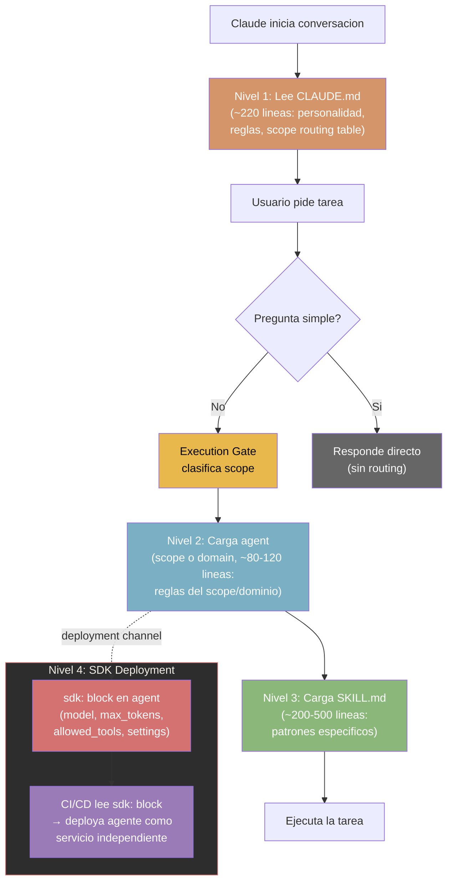
```mermaid
flowchart TD
    START["Claude inicia conversacion"]
    READ["Nivel 1: Lee CLAUDE.md<br/>(~220 lineas: personalidad,<br/>reglas, scope routing table)"]
    TASK["Usuario pide tarea"]
    GATE["Execution Gate<br/>clasifica scope"]
    LOAD_AGENT["Nivel 2: Carga agent<br/>(scope o domain, ~80-120 lineas:<br/>reglas del scope/dominio)"]
    LOAD_SKILL["Nivel 3: Carga SKILL.md<br/>(~200-500 lineas:<br/>patrones especificos)"]
    WORK["Ejecuta la tarea"]
    SIMPLE{"Pregunta simple?"}
    DIRECT["Responde directo<br/>(sin routing)"]

    subgraph SDK_LEVEL["Nivel 4: SDK Deployment"]
        SDK_BLOCK["sdk: block en agent<br/>(model, max_tokens,<br/>allowed_tools, settings)"]
        CI_CD["CI/CD lee sdk: block<br/>→ deploya agente como<br/>servicio independiente"]
    end

    START --> READ --> TASK --> SIMPLE
    SIMPLE -->|"Si"| DIRECT
    SIMPLE -->|"No"| GATE --> LOAD_AGENT --> LOAD_SKILL --> WORK
    LOAD_AGENT -.->|"deployment channel"| SDK_BLOCK --> CI_CD

    style READ fill:#D4956A,color:#fff
    style LOAD_AGENT fill:#7AAFC4,color:#fff
    style LOAD_SKILL fill:#8BB87A,color:#fff
    style GATE fill:#E8B84D,color:#000
    style DIRECT fill:#666,color:#fff
    style SDK_LEVEL fill:#2d2d2d,stroke:#D47272,color:#F5EDE4
    style SDK_BLOCK fill:#D47272,color:#fff
    style CI_CD fill:#9B7AB8,color:#fff
```

> **Mapeo MoE**: El Nivel 1 es el **router** (CLAUDE.md, ~220 lineas). El Nivel 2 carga al **expert** (domain agent, ~80-120 lineas de thick persona). El Nivel 3 carga los **parameters** (skill, ~200-500 lineas de patrones especificos). Solo se carga lo que se necesita — los domain agents corren como subprocesos autonomos (Task tool), no como contexto inyectado en el agente principal. El **Nivel 4** es un canal de deployment: el bloque `sdk:` en cada agent define model, max_tokens, allowed_tools y settings, permitiendo que CI/CD despliegue agentes como servicios independientes.

---

## Continuidad de Sesion

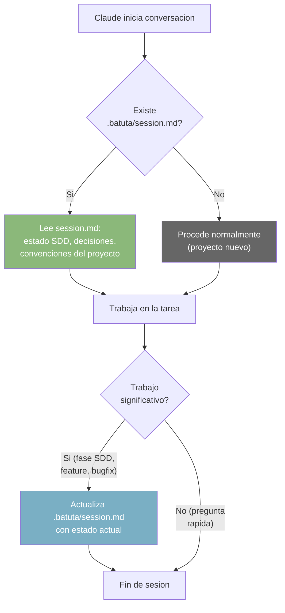
```mermaid
flowchart TD
    START["Claude inicia conversacion"]
    CHECK{"Existe<br/>.batuta/session.md?"}
    READ_SESSION["Lee session.md:<br/>estado SDD, decisiones,<br/>convenciones del proyecto"]
    NO_SESSION["Procede normalmente<br/>(proyecto nuevo)"]
    WORK["Trabaja en la tarea"]
    SIGNIFICANT{"Trabajo<br/>significativo?"}
    UPDATE["Actualiza .batuta/session.md<br/>con estado actual"]
    END_SESSION["Fin de sesion"]

    START --> CHECK
    CHECK -->|"Si"| READ_SESSION --> WORK
    CHECK -->|"No"| NO_SESSION --> WORK
    WORK --> SIGNIFICANT
    SIGNIFICANT -->|"Si (fase SDD,<br/>feature, bugfix)"| UPDATE --> END_SESSION
    SIGNIFICANT -->|"No (pregunta<br/>rapida)"| END_SESSION

    style READ_SESSION fill:#8BB87A,color:#fff
    style UPDATE fill:#7AAFC4,color:#fff
    style NO_SESSION fill:#666,color:#fff
```

> Cada conversacion empieza leyendo el contexto de la anterior. Al terminar trabajo significativo, actualiza el archivo para la proxima sesion.

---

## Deteccion de Skills Faltantes

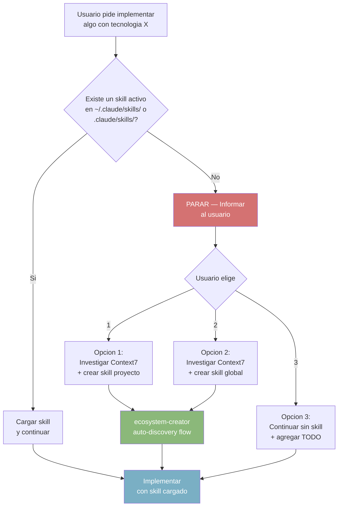
```mermaid
flowchart TD
    START["Usuario pide implementar<br/>algo con tecnologia X"]
    CHECK{"Existe un skill activo<br/>en ~/.claude/skills/ o<br/>.claude/skills/?"}
    LOAD["Cargar skill<br/>y continuar"]
    STOP["PARAR — Informar<br/>al usuario"]
    OPTIONS{"Usuario elige"}
    OPT1["Opcion 1:<br/>Investigar Context7<br/>+ crear skill proyecto"]
    OPT2["Opcion 2:<br/>Investigar Context7<br/>+ crear skill global"]
    OPT3["Opcion 3:<br/>Continuar sin skill<br/>+ agregar TODO"]
    CREATE["ecosystem-creator<br/>auto-discovery flow"]
    CONTINUE["Implementar<br/>con skill cargado"]

    START --> CHECK
    CHECK -->|"Si"| LOAD
    CHECK -->|"No"| STOP
    LOAD --> CONTINUE
    STOP --> OPTIONS
    OPTIONS -->|"1"| OPT1
    OPTIONS -->|"2"| OPT2
    OPTIONS -->|"3"| OPT3
    OPT1 --> CREATE
    OPT2 --> CREATE
    CREATE --> CONTINUE
    OPT3 --> CONTINUE

    style STOP fill:#D47272,color:#fff
    style CREATE fill:#8BB87A,color:#fff
    style CONTINUE fill:#7AAFC4,color:#fff
```

---

## Scope Rule (Regla de Alcance)

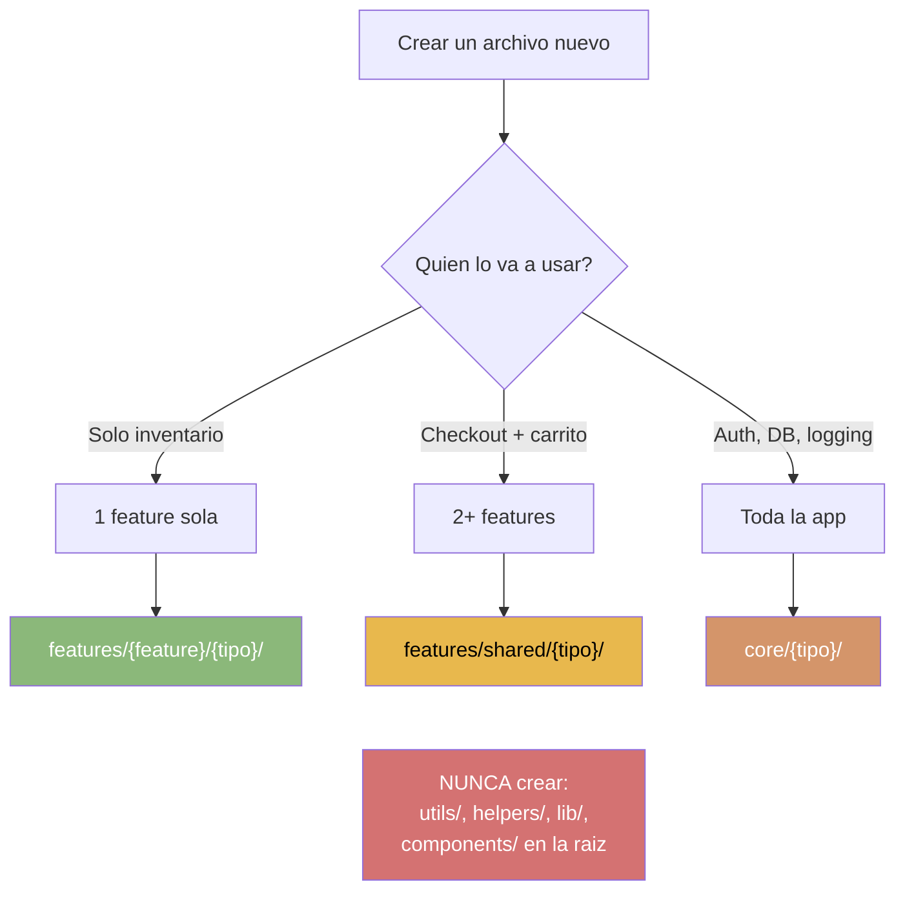
```mermaid
flowchart TD
    START["Crear un archivo nuevo"]
    Q{"Quien lo va a usar?"}
    F1["1 feature sola"]
    F2["2+ features"]
    FALL["Toda la app"]

    PATH1["features/{feature}/{tipo}/"]
    PATH2["features/shared/{tipo}/"]
    PATH3["core/{tipo}/"]

    NEVER["NUNCA crear:<br/>utils/, helpers/, lib/,<br/>components/ en la raiz"]

    START --> Q
    Q -->|"Solo inventario"| F1
    Q -->|"Checkout + carrito"| F2
    Q -->|"Auth, DB, logging"| FALL
    F1 --> PATH1
    F2 --> PATH2
    FALL --> PATH3

    PATH1 ~~~ NEVER
    PATH2 ~~~ NEVER
    PATH3 ~~~ NEVER

    style PATH1 fill:#8BB87A,color:#fff
    style PATH2 fill:#E8B84D,color:#000
    style PATH3 fill:#D4956A,color:#fff
    style NEVER fill:#D47272,color:#fff
```

---

## Auto-Update SPO (Propagacion de Skills)

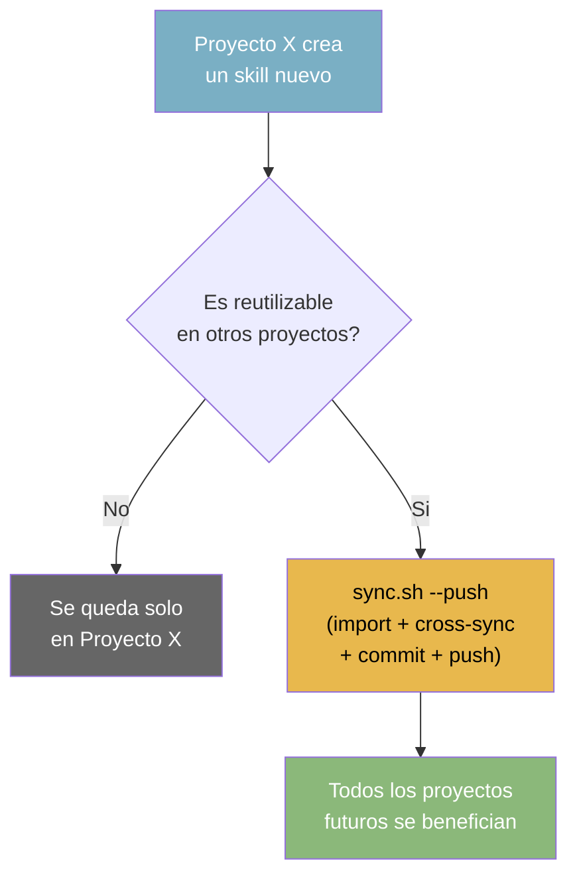
```mermaid
flowchart TD
    PROJECT["Proyecto X crea<br/>un skill nuevo"]
    Q1{"Es reutilizable<br/>en otros proyectos?"}
    STAYS["Se queda solo<br/>en Proyecto X"]
    PUSH_CMD["sync.sh --push<br/>(import + cross-sync<br/>+ commit + push)"]
    BENEFIT["Todos los proyectos<br/>futuros se benefician"]

    PROJECT --> Q1
    Q1 -->|"No"| STAYS
    Q1 -->|"Si"| PUSH_CMD --> BENEFIT

    style PROJECT fill:#7AAFC4,color:#fff
    style BENEFIT fill:#8BB87A,color:#fff
    style STAYS fill:#666,color:#fff
    style PUSH_CMD fill:#E8B84D,color:#000
```

---

## Modelo de Ejecucion de 3 Niveles (v13.1)

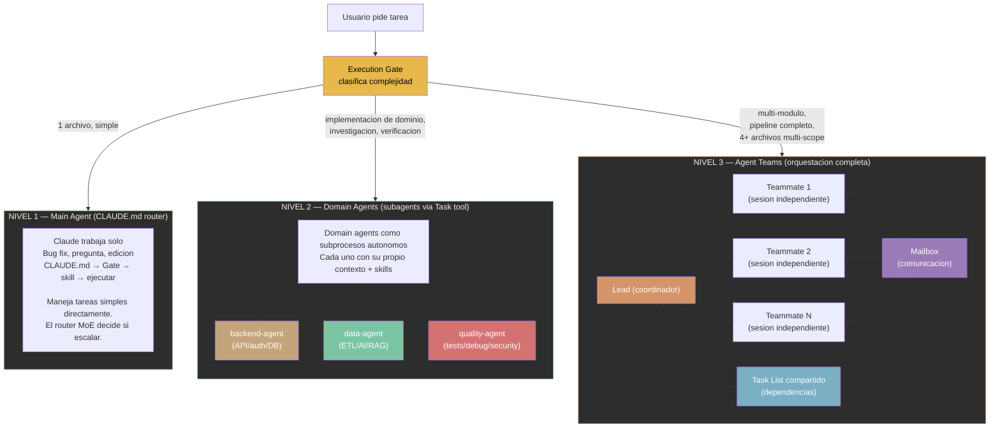
```mermaid
flowchart TD
    USER["Usuario pide tarea"]
    GATE["Execution Gate<br/>clasifica complejidad"]

    subgraph NIVEL1["NIVEL 1 — Main Agent (CLAUDE.md router)"]
        SOLO["Claude trabaja solo<br/>Bug fix, pregunta, edicion<br/>CLAUDE.md → Gate → skill → ejecutar<br/><br/>Maneja tareas simples directamente.<br/>El router MoE decide si escalar."]
    end

    subgraph NIVEL2["NIVEL 2 — Domain Agents (subagents via Task tool)"]
        direction TB
        SUBAGENT["Domain agents como subprocesos autonomos<br/>Cada uno con su propio contexto + skills"]
        BACKEND_SUB["backend-agent<br/>(API/auth/DB)"]
        DATA_SUB["data-agent<br/>(ETL/AI/RAG)"]
        QUALITY_SUB["quality-agent<br/>(tests/debug/security)"]

        SUBAGENT --> BACKEND_SUB
        SUBAGENT --> DATA_SUB
        SUBAGENT --> QUALITY_SUB
    end

    subgraph NIVEL3["NIVEL 3 — Agent Teams (orquestacion completa)"]
        LEAD["Lead (coordinador)"]
        TM1["Teammate 1<br/>(sesion independiente)"]
        TM2["Teammate 2<br/>(sesion independiente)"]
        TM3["Teammate N<br/>(sesion independiente)"]
        MAILBOX["Mailbox<br/>(comunicacion)"]
        TASKLIST["Task List compartido<br/>(dependencias)"]

        LEAD --> TM1
        LEAD --> TM2
        LEAD --> TM3
        TM1 <--> MAILBOX
        TM2 <--> MAILBOX
        TM3 <--> MAILBOX
        LEAD <--> TASKLIST
    end

    USER --> GATE
    GATE -->|"1 archivo, simple"| NIVEL1
    GATE -->|"implementacion de dominio,<br/>investigacion, verificacion"| NIVEL2
    GATE -->|"multi-modulo,<br/>pipeline completo,<br/>4+ archivos multi-scope"| NIVEL3

    style NIVEL1 fill:#2d2d2d,stroke:#8BB87A,color:#F5EDE4
    style NIVEL2 fill:#2d2d2d,stroke:#7AAFC4,color:#F5EDE4
    style NIVEL3 fill:#2d2d2d,stroke:#D4956A,color:#F5EDE4
    style GATE fill:#E8B84D,color:#000
    style LEAD fill:#D4956A,color:#fff
    style MAILBOX fill:#9B7AB8,color:#fff
    style TASKLIST fill:#7AAFC4,color:#fff
    style BACKEND_SUB fill:#C4A47A,color:#fff
    style DATA_SUB fill:#7AC4A4,color:#fff
    style QUALITY_SUB fill:#D47272,color:#fff
```

> **Nivel 1** = Main agent (CLAUDE.md como router MoE). Maneja tareas simples directamente. **Nivel 2** = Domain agents como subprocesos autonomos via Task tool. Cada experto carga su propio contexto, ahorrando tokens en el agente principal. **Nivel 3** = Agent Teams con orquestacion completa: teammates con sesiones independientes, mailbox para comunicacion y task list con dependencias. El Execution Gate recomienda el nivel segun la complejidad.

---

## Ciclo de Vida de un Agent Team (v11.3)

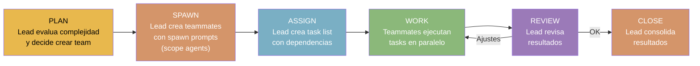
```mermaid
flowchart LR
    PLAN["PLAN<br/>Lead evalua complejidad<br/>y decide crear team"]
    SPAWN["SPAWN<br/>Lead crea teammates<br/>con spawn prompts<br/>(scope agents)"]
    ASSIGN["ASSIGN<br/>Lead crea task list<br/>con dependencias"]
    WORK["WORK<br/>Teammates ejecutan<br/>tasks en paralelo"]
    REVIEW["REVIEW<br/>Lead revisa<br/>resultados"]
    CLOSE["CLOSE<br/>Lead consolida<br/>resultados"]

    PLAN --> SPAWN --> ASSIGN --> WORK
    WORK --> REVIEW
    REVIEW -->|"OK"| CLOSE
    REVIEW -->|"Ajustes"| WORK

    style PLAN fill:#E8B84D,color:#000
    style SPAWN fill:#D4956A,color:#fff
    style ASSIGN fill:#7AAFC4,color:#fff
    style WORK fill:#8BB87A,color:#fff
    style REVIEW fill:#9B7AB8,color:#fff
    style CLOSE fill:#D4956A,color:#fff
```

> PLAN → SPAWN → ASSIGN → WORK → REVIEW → CLOSE. El lead revisa los resultados de cada teammate y consolida.

---

## O.R.T.A. con Agent Teams (v11.3)

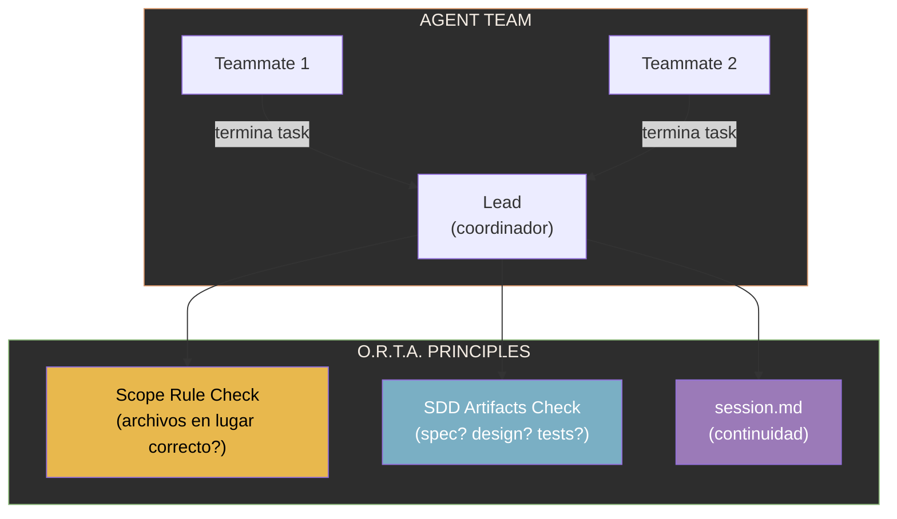
```mermaid
flowchart TD
    subgraph TEAM["AGENT TEAM"]
        LEAD["Lead<br/>(coordinador)"]
        TM1["Teammate 1"]
        TM2["Teammate 2"]
    end

    subgraph ORTA["O.R.T.A. PRINCIPLES"]
        SCOPE["Scope Rule Check<br/>(archivos en lugar correcto?)"]
        SDD_CHECK["SDD Artifacts Check<br/>(spec? design? tests?)"]
        SESSION["session.md<br/>(continuidad)"]
    end

    TM1 -->|"termina task"| LEAD
    TM2 -->|"termina task"| LEAD

    LEAD --> SCOPE
    LEAD --> SDD_CHECK
    LEAD --> SESSION

    style TEAM fill:#2d2d2d,stroke:#D4956A,color:#F5EDE4
    style ORTA fill:#2d2d2d,stroke:#8BB87A,color:#F5EDE4
    style SESSION fill:#9B7AB8,color:#fff
    style SCOPE fill:#E8B84D,color:#000
    style SDD_CHECK fill:#7AAFC4,color:#fff
```

> O.R.T.A. principles in Agent Teams: **[O]** Lead observes teammate results. **[R]** Task list con dependencias = mismo orden. **[T]** Cada teammate tiene ID, tasks → artefactos. **[A]** Lead revisa calidad antes de consolidar.

---

## SDD Pipeline como Task List Paralelo (v7)

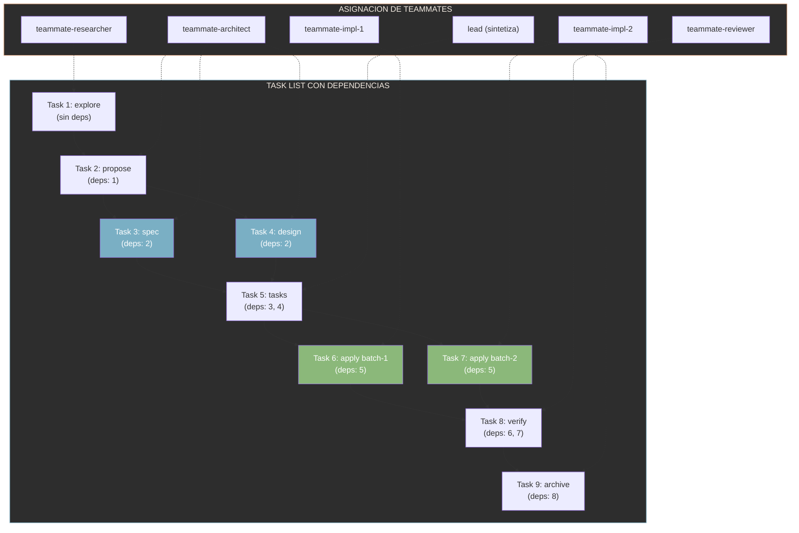
```mermaid
flowchart TD
    subgraph TASKS["TASK LIST CON DEPENDENCIAS"]
        T1["Task 1: explore<br/>(sin deps)"]
        T2["Task 2: propose<br/>(deps: 1)"]
        T3["Task 3: spec<br/>(deps: 2)"]
        T4["Task 4: design<br/>(deps: 2)"]
        T5["Task 5: tasks<br/>(deps: 3, 4)"]
        T6["Task 6: apply batch-1<br/>(deps: 5)"]
        T7["Task 7: apply batch-2<br/>(deps: 5)"]
        T8["Task 8: verify<br/>(deps: 6, 7)"]
        T9["Task 9: archive<br/>(deps: 8)"]
    end

    subgraph TEAMMATES["ASIGNACION DE TEAMMATES"]
        RESEARCHER["teammate-researcher"]
        ARCHITECT["teammate-architect"]
        LEAD_TM["lead (sintetiza)"]
        IMPL1["teammate-impl-1"]
        IMPL2["teammate-impl-2"]
        REVIEWER["teammate-reviewer"]
    end

    T1 --> T2
    T2 --> T3
    T2 --> T4
    T3 --> T5
    T4 --> T5
    T5 --> T6
    T5 --> T7
    T6 --> T8
    T7 --> T8
    T8 --> T9

    RESEARCHER -.-> T1
    ARCHITECT -.-> T2
    ARCHITECT -.-> T3
    ARCHITECT -.-> T4
    LEAD_TM -.-> T5
    IMPL1 -.-> T6
    IMPL2 -.-> T7
    REVIEWER -.-> T8
    LEAD_TM -.-> T9

    style TASKS fill:#2d2d2d,stroke:#7AAFC4,color:#F5EDE4
    style TEAMMATES fill:#2d2d2d,stroke:#D4956A,color:#F5EDE4
    style T3 fill:#7AAFC4,color:#fff
    style T4 fill:#7AAFC4,color:#fff
    style T6 fill:#8BB87A,color:#fff
    style T7 fill:#8BB87A,color:#fff
```

> **spec** y **design** corren EN PARALELO (resaltados en azul). **apply batch-1** y **apply batch-2** corren EN PARALELO (resaltados en verde). El lead sintetiza tasks y archiva. Las dependencias garantizan el orden correcto.

---

## Scope Agents: Documentos + Spawn Prompts (v7)

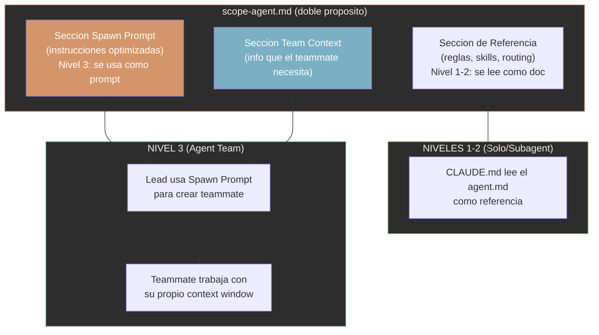
```mermaid
flowchart TD
    subgraph AGENT_FILE["scope-agent.md (doble proposito)"]
        REFERENCE["Seccion de Referencia<br/>(reglas, skills, routing)<br/>Nivel 1-2: se lee como doc"]
        SPAWN["Seccion Spawn Prompt<br/>(instrucciones optimizadas)<br/>Nivel 3: se usa como prompt"]
        CONTEXT["Seccion Team Context<br/>(info que el teammate necesita)"]
    end

    subgraph NIVEL12["NIVELES 1-2 (Solo/Subagent)"]
        READ_DOC["CLAUDE.md lee el agent.md<br/>como referencia"]
    end

    subgraph NIVEL3_USE["NIVEL 3 (Agent Team)"]
        SPAWN_TM["Lead usa Spawn Prompt<br/>para crear teammate"]
        TM_RESULT["Teammate trabaja con<br/>su propio context window"]
    end

    REFERENCE --> READ_DOC
    SPAWN --> SPAWN_TM
    CONTEXT --> SPAWN_TM
    SPAWN_TM --> TM_RESULT

    style AGENT_FILE fill:#2d2d2d,stroke:#D4956A,color:#F5EDE4
    style NIVEL12 fill:#2d2d2d,stroke:#8BB87A,color:#F5EDE4
    style NIVEL3_USE fill:#2d2d2d,stroke:#7AAFC4,color:#F5EDE4
    style SPAWN fill:#D4956A,color:#fff
    style CONTEXT fill:#7AAFC4,color:#fff
```

> Los scope agents **no desaparecen** — evolucionan. En Nivel 1-2 funcionan como siempre (documentos de referencia). En Nivel 3, sus secciones Spawn Prompt y Team Context se usan para crear teammates con context windows independientes.

---

## Flujo Completo: Desde Carpeta Vacia hasta App en Internet (v11)

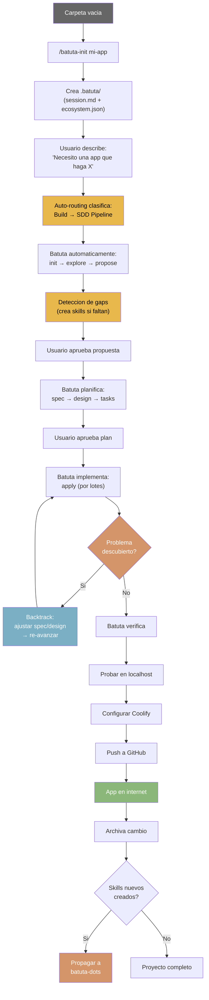
```mermaid
flowchart TD
    EMPTY["Carpeta vacia"]
    INIT_CMD["/batuta-init mi-app"]
    BATUTA_DIR["Crea .batuta/<br/>(session.md + ecosystem.json)"]
    DESCRIBE["Usuario describe:<br/>'Necesito una app que haga X'"]
    AUTOROUTE["Auto-routing clasifica:<br/>Build → SDD Pipeline"]
    SDD_AUTO["Batuta automaticamente:<br/>init → explore → propose"]
    GAP["Deteccion de gaps<br/>(crea skills si faltan)"]
    APPROVAL["Usuario aprueba propuesta"]
    PLAN["Batuta planifica:<br/>spec → design → tasks"]
    APPROVAL2["Usuario aprueba plan"]
    SDD_APPLY["Batuta implementa:<br/>apply (por lotes)"]
    BACKTRACK{"Problema<br/>descubierto?"}
    RETHINK["Backtrack:<br/>ajustar spec/design<br/>→ re-avanzar"]
    SDD_VERIFY["Batuta verifica"]
    TEST["Probar en localhost"]
    DEPLOY["Configurar Coolify"]
    PUSH["Push a GitHub"]
    LIVE["App en internet"]
    SDD_ARCHIVE["Archiva cambio"]
    UPDATE{"Skills nuevos<br/>creados?"}
    PROPAGATE["Propagar a<br/>batuta-dots"]

    EMPTY --> INIT_CMD --> BATUTA_DIR --> DESCRIBE --> AUTOROUTE
    AUTOROUTE --> SDD_AUTO --> GAP --> APPROVAL
    APPROVAL --> PLAN --> APPROVAL2 --> SDD_APPLY
    SDD_APPLY --> BACKTRACK
    BACKTRACK -->|"Si"| RETHINK --> SDD_APPLY
    BACKTRACK -->|"No"| SDD_VERIFY
    SDD_VERIFY --> TEST --> DEPLOY --> PUSH --> LIVE
    LIVE --> SDD_ARCHIVE --> UPDATE
    UPDATE -->|"Si"| PROPAGATE
    UPDATE -->|"No"| FIN["Proyecto completo"]

    style EMPTY fill:#666,color:#fff
    style LIVE fill:#8BB87A,color:#fff
    style GAP fill:#E8B84D,color:#000
    style PROPAGATE fill:#D4956A,color:#fff
    style AUTOROUTE fill:#E8B84D,color:#000
    style BACKTRACK fill:#D4956A,color:#fff
    style RETHINK fill:#7AAFC4,color:#fff
```

---

## Native Hooks: Deterministic Enforcement (v11.3)

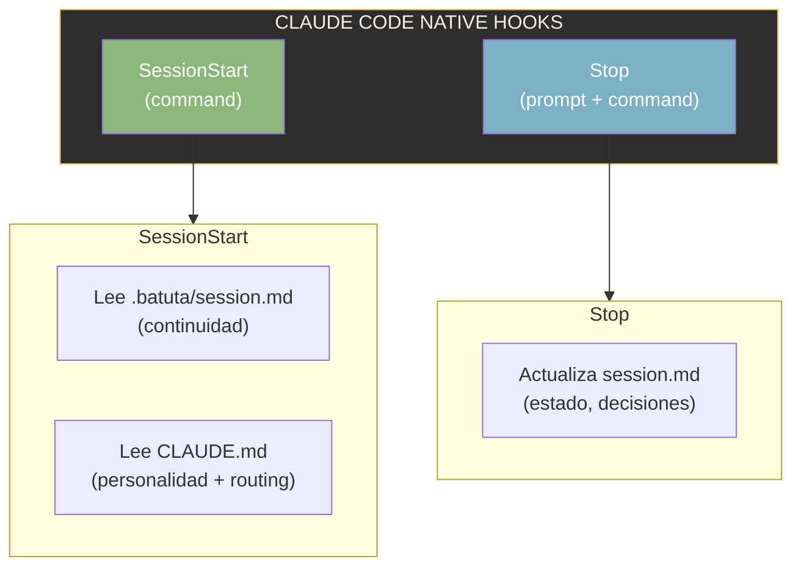
```mermaid
flowchart TD
    subgraph HOOKS["CLAUDE CODE NATIVE HOOKS"]
        direction TB
        SS["SessionStart<br/>(command)"]
        STOP["Stop<br/>(prompt + command)"]
    end

    subgraph SS_ACTIONS["SessionStart"]
        READ_SESSION["Lee .batuta/session.md<br/>(continuidad)"]
        READ_CLAUDE["Lee CLAUDE.md<br/>(personalidad + routing)"]
    end

    subgraph STOP_ACTIONS["Stop"]
        UPDATE_SESSION["Actualiza session.md<br/>(estado, decisiones)"]
    end

    SS --> SS_ACTIONS
    STOP --> STOP_ACTIONS

    style HOOKS fill:#2d2d2d,stroke:#E8B84D,color:#F5EDE4
    style SS fill:#8BB87A,color:#fff
    style STOP fill:#7AAFC4,color:#fff
```

> Los hooks nativos de Claude Code ejecutan de forma **determinista** — no dependen de que Claude "recuerde" hacerlo. SessionStart carga contexto al iniciar, Stop guarda estado al cerrar.

---

## AI Validation Pyramid (v8)

```mermaid
flowchart BT
    subgraph PYRAMID["PIRAMIDE DE VALIDACION AI"]
        direction BT
        L1["Layer 1: Type Check / Lint<br/>(automatico, agente)"]
        L2["Layer 2: Unit Tests<br/>(automatico, agente)"]
        L3["Layer 3: E2E / Integration<br/>(automatico, agente)"]
        L4["Layer 4: Code Review<br/>(humano o agente senior)"]
        L5["Layer 5: Manual Testing<br/>(humano obligatorio)"]
    end

    L1 --> L2 --> L3 --> L4 --> L5

    subgraph LABELS["QUIEN EJECUTA"]
        AUTO["Layers 1-3: AGENTE<br/>(automatico, rapido)"]
        HUMAN["Layers 4-5: HUMANO<br/>(juicio, validacion final)"]
    end

    style L1 fill:#8BB87A,color:#fff
    style L2 fill:#8BB87A,color:#fff
    style L3 fill:#7AAFC4,color:#fff
    style L4 fill:#E8B84D,color:#000
    style L5 fill:#D4956A,color:#fff
    style AUTO fill:#8BB87A,color:#fff
    style HUMAN fill:#D4956A,color:#fff
```

> Las capas 1-3 se ejecutan automaticamente por el agente (sdd-verify). Las capas 4-5 REQUIEREN un humano. No existe la validacion 100% automatica — el humano siempre tiene la ultima palabra.

---

## Contract-First Protocol (v9)

```mermaid
flowchart TD
    LEAD["Lead evalua tarea"]
    CONTRACTS["Define contratos ANTES de crear teammates"]

    subgraph CONTRACT_DEF["DEFINICION DE CONTRATOS"]
        INPUT["Input Contract<br/>(que recibe cada teammate)"]
        OUTPUT["Output Contract<br/>(que debe producir)"]
        FILES["File Ownership<br/>(que archivos puede tocar)"]
    end

    SPAWN["Spawn teammates con contratos"]

    subgraph TEAMMATES["TEAMMATES TRABAJANDO"]
        TM1["Teammate A<br/>Owns: src/api/*"]
        TM2["Teammate B<br/>Owns: src/ui/*"]
        TM3["Teammate C<br/>Owns: tests/*"]
    end

    DIFF["Contract Diff<br/>(output vs contrato)"]
    CROSS["Cross-Review<br/>(A revisa interfaces de B)"]

    LEAD --> CONTRACTS
    CONTRACTS --> CONTRACT_DEF
    CONTRACT_DEF --> SPAWN --> TEAMMATES
    TEAMMATES --> DIFF
    DIFF -->|"OK"| CROSS
    DIFF -->|"Falta campo"| TEAMMATES
    CROSS --> DONE["Task completa"]

    style CONTRACT_DEF fill:#2d2d2d,stroke:#E8B84D,color:#F5EDE4
    style TEAMMATES fill:#2d2d2d,stroke:#8BB87A,color:#F5EDE4
    style DIFF fill:#E8B84D,color:#000
    style CROSS fill:#7AAFC4,color:#fff
    style FILES fill:#D4956A,color:#fff
```

> El lead define QUE recibe y QUE produce cada teammate ANTES de crearlos. File Ownership evita conflictos: cada archivo pertenece a exactamente 1 teammate. Contract Diff verifica que el output cumpla el contrato antes de cerrar la task.

---

## Team Templates + Playbook (v9)

```mermaid
flowchart TD
    USER["Usuario describe proyecto"]
    DECIDE{"Que tipo de proyecto?"}

    subgraph TEMPLATES["TEAM TEMPLATES (teams/templates/)"]
        T1["nextjs-saas.md<br/>App SaaS multi-tenant"]
        T2["fastapi-service.md<br/>Microservicio API"]
        T3["n8n-automation.md<br/>Automatizacion workflows"]
        T4["ai-agent.md<br/>Agente IA (LangChain/ADK)"]
        T5["data-pipeline.md<br/>Pipeline de datos ETL"]
        T6["refactoring.md<br/>Refactoring legacy"]
    end

    PLAYBOOK["teams/playbook.md<br/>Guia: cuando usar teams,<br/>errores comunes, mejores practicas"]

    LEAD["Lead configura equipo<br/>usando template + contratos"]
    TEAM["Agent Team ejecuta"]

    USER --> DECIDE
    DECIDE --> TEMPLATES
    TEMPLATES --> LEAD
    PLAYBOOK -.->|"consulta"| LEAD
    LEAD --> TEAM

    style TEMPLATES fill:#2d2d2d,stroke:#8BB87A,color:#F5EDE4
    style PLAYBOOK fill:#7AAFC4,color:#fff
    style LEAD fill:#D4956A,color:#fff
```

> Los templates son "recetas pre-armadas" para equipos de agentes. El playbook es la guia de cuando y como usarlos. Cada template define composicion, contratos, file ownership, y lecciones aprendidas.

---

## Security-Audit Integration (v9)

```mermaid
flowchart TD
    subgraph SDD["SDD PIPELINE"]
        DESIGN["sdd-design<br/>(incluye Threat Model)"]
        APPLY["sdd-apply<br/>(escribe codigo)"]
        VERIFY["sdd-verify<br/>(incluye Security Check)"]
    end

    subgraph SECURITY["SECURITY-AUDIT SKILL"]
        CHECKLIST["AI-First Checklist<br/>(10 puntos OWASP+AI)"]
        THREAT["Threat Model Template<br/>(assets, vectors, mitigations)"]
        SECRETS["Secrets Scanning<br/>(regex patterns)"]
        DEPS["Dependency Audit<br/>(npm/pip/cargo audit)"]
        CLAUDE_SEC["Claude Security<br/>(prompt protection, PII)"]
    end

    DESIGN -->|"Step: Threat Model"| THREAT
    VERIFY -->|"Step 4.7: Security Check"| CHECKLIST
    VERIFY -->|"Step 4.7"| SECRETS
    VERIFY -->|"Step 4.7"| DEPS

    style SDD fill:#2d2d2d,stroke:#7AAFC4,color:#F5EDE4
    style SECURITY fill:#2d2d2d,stroke:#D47272,color:#F5EDE4
    style CHECKLIST fill:#D47272,color:#fff
    style THREAT fill:#E8B84D,color:#000
    style SECRETS fill:#D4956A,color:#fff
```

> El skill de security-audit se integra en DOS puntos del pipeline: en sdd-design (threat model ANTES de construir) y en sdd-verify (security check DESPUES de construir). Cubre OWASP + amenazas especificas de codigo generado por AI.

---

## Hub & Spoke: Sync Multi-Plataforma (v13)

```mermaid
flowchart TD
    subgraph HUB["batuta-dots (HUB)"]
        BC["BatutaClaude/<br/>skills/ (38) + agents/ (6)"]
        BA["BatutaAntigravity/<br/>skills/ (filtrados)"]
        SYNC["infra/sync.sh"]
    end

    subgraph SPOKE_CLAUDE["Proyecto A (Claude Code)"]
        PC_SKILLS["~/.claude/skills/"]
        PC_AGENTS[".claude/agents/<br/>(domain agents provisionados)"]
        PC_LOCAL[".claude/skills/<br/>(proyecto-local)"]
        PC_ECO[".batuta/ecosystem.json"]
    end

    subgraph SPOKE_ANTIGRAVITY["Proyecto B (Antigravity Lite)"]
        PA_SKILLS[".agent/skills/"]
        PA_ECO[".batuta/ecosystem.json"]
    end

    BC -->|"setup.sh --sync"| PC_SKILLS
    BC -->|"sdd-init provisioning"| PC_AGENTS
    BC -->|"sync.sh --to-antigravity"| BA
    BA -->|"setup-antigravity.sh"| PA_SKILLS

    PC_LOCAL -->|"sync.sh --push"| BC
    PA_SKILLS -->|"sync.sh --push"| BC

    PC_ECO -.->|"version check"| HUB
    PA_ECO -.->|"version check"| HUB

    style HUB fill:#2d2d2d,stroke:#D4956A,color:#F5EDE4
    style SPOKE_CLAUDE fill:#2d2d2d,stroke:#7AAFC4,color:#F5EDE4
    style SPOKE_ANTIGRAVITY fill:#2d2d2d,stroke:#8BB87A,color:#F5EDE4
    style SYNC fill:#E8B84D,color:#000
    style PC_AGENTS fill:#9B7AB8,color:#fff
```

> batuta-dots es el **hub central**. Los proyectos y plataformas son **spokes**. Skills y agents fluyen: hub → spokes. Los proyectos reciben tanto skills como domain agents provisionados segun su tech stack. `sync.sh --push` combina import + cross-sync + commit + push en un solo comando. El campo `platforms` en SKILL.md filtra que skills van a cada plataforma. `ecosystem.json` detecta drift de version.

---

## Folder Structure (v13)

```mermaid
flowchart TD
    subgraph ROOT["batuta-dots/"]
        CLAUDE_DIR["BatutaClaude/<br/>CLAUDE.md, settings.json,<br/>agents/, skills/, commands/"]
        ANTIGRAVITY_DIR["BatutaAntigravity/ (Lite)<br/>GEMINI.md, workflows/,<br/>setup-antigravity.sh"]
        INFRA_DIR["infra/<br/>setup.sh, sync.sh, hooks/"]
        DOCS["docs/<br/>architecture/, guides/, qa/"]
        TEAMS["teams/<br/>templates/, playbook.md"]
        ACADEMIA["academia/<br/>8 modulos, 54 lecciones"]
        README["README.md, README.es.md"]
        CHANGELOG["CHANGELOG-refactor.md"]
    end

    subgraph CLAUDE_DETAIL["BatutaClaude/"]
        CLAUDE_MD["CLAUDE.md (router)"]
        AGENTS["agents/ (6 agents)<br/>Scope: pipeline, infra, observability<br/>Domain: backend, quality, data"]
        SKILLS_38["skills/ (38 skills)<br/>pipeline (27: 9 SDD + 6 CTO + 12 tech),<br/>infra (9: +skill-eval),<br/>observability (2)"]
    end

    subgraph ANTIGRAVITY_DETAIL["BatutaAntigravity/ (Lite)"]
        GEMINI_MD["GEMINI.md (CTO brain)"]
        WORKFLOWS["workflows/ (11)<br/>SDD + save-session +<br/>push-skill + batuta-update"]
        SETUP_AG["setup-antigravity.sh"]
    end

    subgraph DOCS_DETAIL["docs/"]
        ARCH["architecture/<br/>diagrama, para-no-tecnicos"]
        GUIDES["guides/<br/>14 guias de uso"]
        QA["qa/<br/>auditorias, correcciones,<br/>tests integracion, smoke tests"]
    end

    CLAUDE_DIR --> CLAUDE_DETAIL
    ANTIGRAVITY_DIR --> ANTIGRAVITY_DETAIL
    DOCS --> DOCS_DETAIL

    style ROOT fill:#2d2d2d,stroke:#D4956A,color:#F5EDE4
    style CLAUDE_DETAIL fill:#2d2d2d,stroke:#7AAFC4,color:#F5EDE4
    style ANTIGRAVITY_DETAIL fill:#2d2d2d,stroke:#8BB87A,color:#F5EDE4
    style DOCS_DETAIL fill:#2d2d2d,stroke:#8BB87A,color:#F5EDE4
    style TEAMS fill:#E8B84D,color:#000
```

---

## Agent Types: Scope vs Domain — MoE Mapping (v13.1)

```mermaid
flowchart TD
    subgraph MOE_LABEL["MIXTURE OF EXPERTS — Roles"]
        direction LR
        MOE_ROUTER["Router = CLAUDE.md"]
        MOE_EXPERTS["Experts = Domain Agents"]
        MOE_PARAMS["Parameters = Skills"]
    end

    subgraph SCOPE["SCOPE AGENTS (maquinaria del hub — no son 'experts' MoE)"]
        direction TB
        PIPELINE["pipeline-agent<br/>SDD lifecycle<br/>(explore → archive)"]
        INFRA["infra-agent<br/>File/skill/agent creation<br/>(scope-rule, ecosystem-creator)"]
        OBS["observability-agent<br/>Session continuity<br/>(session.md, hooks)"]
    end

    subgraph DOMAIN["DOMAIN AGENTS (los 'experts' del MoE — thick persona)"]
        direction TB
        BACKEND["backend-agent<br/>API, auth, DB patterns<br/>(80-120 lineas expertise)<br/>(provisionado: Python|Node|Go)"]
        QUALITY["quality-agent<br/>TDD, debugging, security<br/>(80-120 lineas expertise)<br/>(siempre provisionado)"]
        DATA["data-agent<br/>ETL, RAG, LLM pipelines<br/>(80-120 lineas expertise)<br/>(provisionado: pandas|ETL|RAG|LLM)"]
    end

    subgraph SDK["SDK DEPLOYABLE (todos los agents)"]
        SDK_BLOCK["Bloque sdk: en frontmatter<br/>model, max_tokens,<br/>allowed_tools, setting_sources,<br/>defer_loading"]
    end

    MOE_ROUTER -.-> SCOPE
    MOE_EXPERTS -.-> DOMAIN
    SCOPE --> SDK_BLOCK
    DOMAIN --> SDK_BLOCK

    style MOE_LABEL fill:#2d2d2d,stroke:#E8B84D,color:#F5EDE4
    style MOE_ROUTER fill:#D4956A,color:#fff
    style MOE_EXPERTS fill:#9B7AB8,color:#fff
    style MOE_PARAMS fill:#8BB87A,color:#fff
    style SCOPE fill:#2d2d2d,stroke:#7AAFC4,color:#F5EDE4
    style DOMAIN fill:#2d2d2d,stroke:#9B7AB8,color:#F5EDE4
    style SDK fill:#2d2d2d,stroke:#D47272,color:#F5EDE4
    style PIPELINE fill:#7AAFC4,color:#fff
    style INFRA fill:#8BB87A,color:#fff
    style OBS fill:#9B7AB8,color:#fff
    style BACKEND fill:#C4A47A,color:#fff
    style QUALITY fill:#D47272,color:#fff
    style DATA fill:#7AC4A4,color:#fff
    style SDK_BLOCK fill:#D47272,color:#fff
```

> En el modelo **MoE**: CLAUDE.md es el **router** (clasifica intent, activa expertos). Los **domain agents** son los **experts** — subprocesos autonomos con "thick persona" de 80-120 lineas de expertise embebido que corren via Task tool, no como contexto inyectado. Los **skills** son los **parameters** — patrones cargados bajo demanda dentro de cada experto. Los **scope agents** no son "experts" en el sentido MoE — son la maquinaria fija del hub (SDD lifecycle, infraestructura, sesion). quality-agent siempre se provisiona; la calidad aplica a todo proyecto. Todos los agents (6 en total) tienen un bloque `sdk:` para deployment independiente.

---

## Eval Flow: Skill Evaluation Framework (v13)

```mermaid
flowchart TD
    subgraph EVAL_MODE["Eval Mode"]
        direction LR
        E_TASK["Tarea de prueba"]
        E_EXEC["Executor<br/>(ejecuta tarea con skill)"]
        E_GRADE["Grader<br/>(evalua quality_criteria<br/>de SKILL.eval.yaml)"]
        E_REPORT["Eval Report<br/>(score + detalles)"]
        E_TASK --> E_EXEC --> E_GRADE --> E_REPORT
    end

    subgraph IMPROVE_MODE["Improve Mode"]
        direction LR
        I_READ["Lee SKILL.md +<br/>resultados de eval"]
        I_ANALYZE["Analyzer<br/>(identifica debilidades)"]
        I_PROPOSAL["Proposal<br/>(ediciones especificas<br/>al SKILL.md)"]
        I_READ --> I_ANALYZE --> I_PROPOSAL
    end

    subgraph BENCHMARK_MODE["Benchmark Mode"]
        direction LR
        B_ITER["Iterator<br/>(ejecuta eval para<br/>N skills)"]
        B_COMPARE["Comparator<br/>(compara scores<br/>entre skills)"]
        B_HEALTH["Health Report<br/>(estado del<br/>ecosistema)"]
        B_ITER --> B_COMPARE --> B_HEALTH
    end

    EVAL_YAML["SKILL.eval.yaml<br/>(quality_criteria,<br/>test_tasks,<br/>grading_rubric)"]

    EVAL_YAML --> E_EXEC
    E_REPORT -.->|"alimenta"| I_READ
    E_REPORT -.->|"alimenta"| B_ITER

    style EVAL_MODE fill:#2d2d2d,stroke:#8BB87A,color:#F5EDE4
    style IMPROVE_MODE fill:#2d2d2d,stroke:#7AAFC4,color:#F5EDE4
    style BENCHMARK_MODE fill:#2d2d2d,stroke:#E8B84D,color:#F5EDE4
    style EVAL_YAML fill:#D4956A,color:#fff
    style E_GRADE fill:#8BB87A,color:#fff
    style I_PROPOSAL fill:#7AAFC4,color:#fff
    style B_HEALTH fill:#E8B84D,color:#000
```

> **Eval Mode**: ejecuta una tarea con y sin el skill, compara la calidad usando criterios definidos en SKILL.eval.yaml. **Improve Mode**: analiza los resultados del eval y propone ediciones concretas al SKILL.md para mejorar su efectividad. **Benchmark Mode**: corre eval para multiples skills y genera un reporte de salud del ecosistema. El formato SKILL.eval.yaml define quality_criteria, test_tasks y grading_rubric para testing conductual de skills.

---

## Anti-Overengineering: Principios de Calibracion (v13.1)

El modelo Opus 4.6 se beneficia de instrucciones **calmadas y directas**. El lenguaje agresivo (NEVER/MUST/ALWAYS en exceso) causa overtriggering — el agente interpreta instrucciones informativas como gates obligatorios.

### Principios

| Principio | Aplicacion en Batuta |
|-----------|---------------------|
| **Enfasis selectivo** | Solo 4 puntos de aprobacion humana usan lenguaje imperativo fuerte (proposal approval, task plan approval, y 2 gates de produccion) |
| **Reglas como advisory** | Las reglas de estilo, tono y formato son "advisory" — guian pero no bloquean |
| **Gates como mandatory** | Solo los gates del pipeline y el Execution Gate son puntos de parada obligatorios |
| **Accion directa sobre delegacion** | Preferir accion directa para tareas simples. Delegar via subagent solo cuando las tareas pueden correr en paralelo, requieren contexto aislado, o involucran workstreams independientes |

> El objetivo es un agente que actue con criterio, no uno que pida permiso para cada linea de codigo. Las reglas existen para prevenir errores recurrentes, no para crear burocracia. Cuando una regla no agrega valor, se revisa via self-heal — no se ignora ni se duplica.

---

## Como ver estos diagramas

Estos diagramas usan **Mermaid**, un formato que se renderiza automaticamente en:
- **GitHub**: Abre este archivo en github.com y los diagramas se ven como imagenes
- **VS Code**: Instala la extension "Markdown Preview Mermaid Support"
- **Mermaid Live Editor**: Copia el codigo entre ```mermaid y ``` en [mermaid.live](https://mermaid.live)
