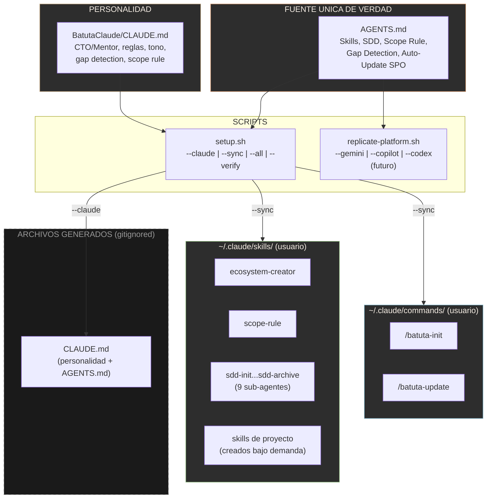
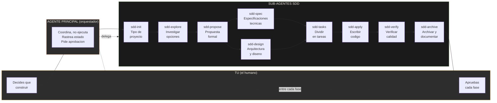
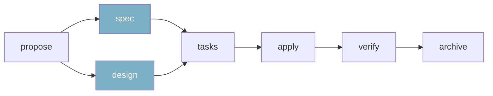
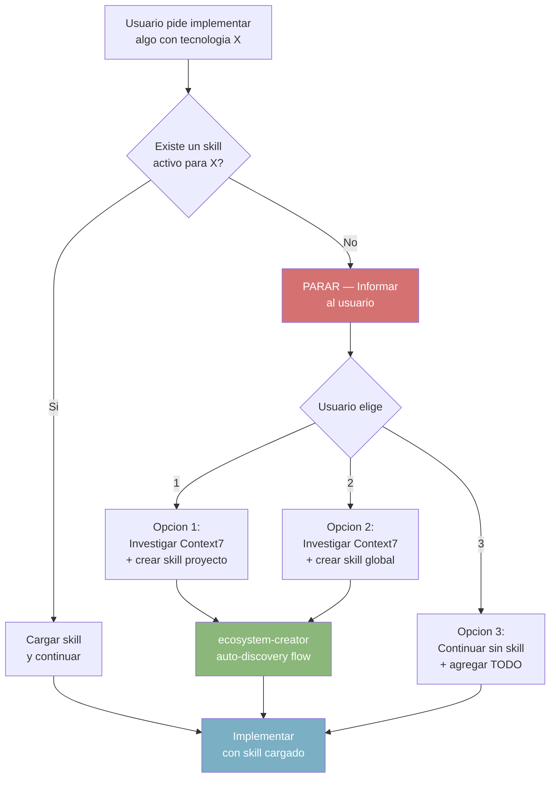
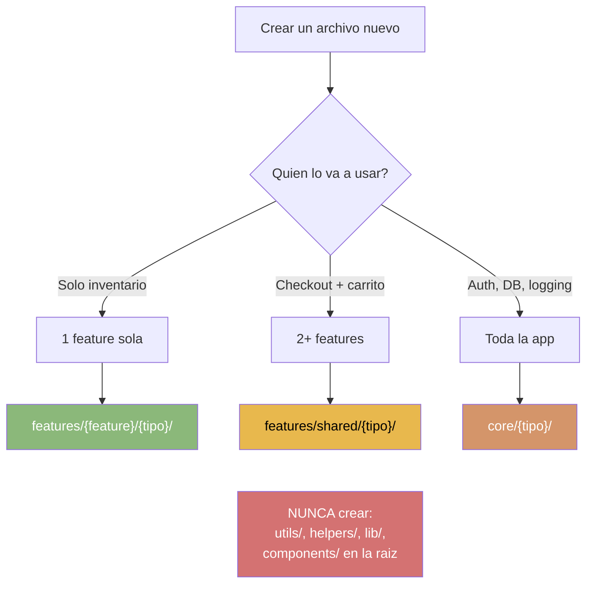
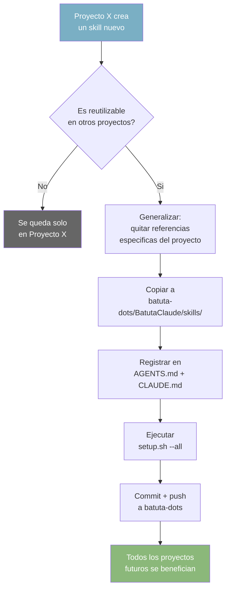
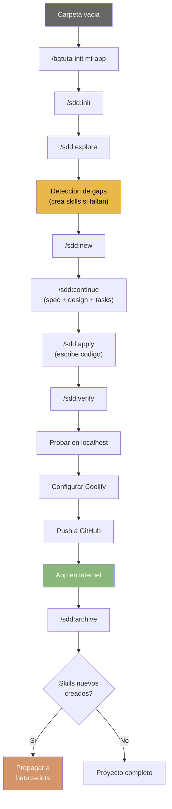

# Diagrama de Arquitectura — Ecosistema Batuta

## Vista General del Ecosistema

---

## Flujo de Trabajo SDD (Spec-Driven Development)

### Dependencias entre fases

> **spec** y **design** pueden ejecutarse en paralelo. Ambos deben completarse antes de **tasks**.

---

## Deteccion de Skills Faltantes

---

## Scope Rule (Regla de Alcance)

---

## Auto-Update SPO (Propagacion de Skills)

---

## Flujo Completo: Desde Carpeta Vacia hasta App en Internet

---

## Como ver estos diagramas

Estos diagramas usan **Mermaid**, un formato que se renderiza automaticamente en:
- **GitHub**: Abre este archivo en github.com y los diagramas se ven como imagenes
- **VS Code**: Instala la extension "Markdown Preview Mermaid Support"
- **Mermaid Live Editor**: Copia el codigo entre \`\`\`mermaid y \`\`\` en [mermaid.live](https://mermaid.live)
